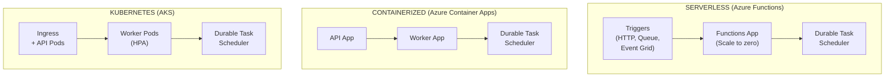
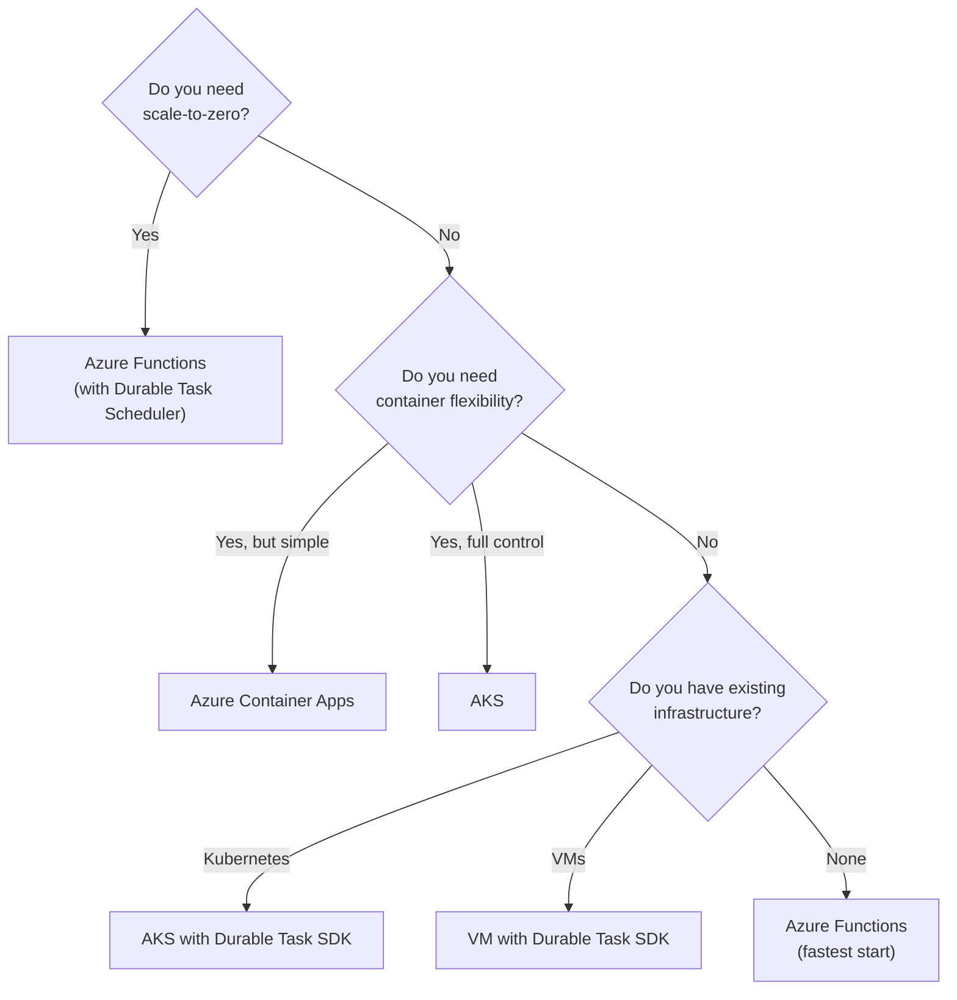

# Architecture Guides
{: .no_toc }

Learn how to architect and deploy durable orchestrations across different Azure compute platforms.
{: .fs-6 .fw-300 }

---

## Overview

Azure Durable technologies can be deployed on various compute platforms, each with different characteristics:

| Platform | Best For | Durable Functions | Durable Task SDK |
|----------|----------|-------------------|------------------|
| Azure Functions | Serverless, event-driven | ✅ Native | ❌ |
| Azure Container Apps | Containerized microservices | ✅ via Extension | ✅ Recommended |
| Azure Kubernetes Service | Full orchestration control | ✅ via Container | ✅ Full Support |
| Virtual Machines | Legacy, special requirements | ❌ | ✅ Full Support |

---

## Architecture Patterns

---

## Detailed Guides

### Compute Platforms

{: .note }
> For comprehensive deployment guides, scaling documentation, and quickstarts, see the [Hosting Options](../hosting-options/index.md) section.

- [Durable Functions with Durable Task Scheduler](durable-functions-dts.md)  
  Use Azure Functions with the managed Durable Task Scheduler backend  
  → [Full Azure Functions Guide](../hosting-options/azure-functions/index.md)

- [Azure Container Apps with Durable Task SDK](aca-dts.md)  
  Deploy containerized workers on Azure Container Apps  
  → [Full Container Apps Guide](../hosting-options/container-apps/index.md)

- [Azure Kubernetes Service with Durable Task SDK](aks-dts.md)  
  Full Kubernetes deployment with scaling and observability  
  → [Full Kubernetes Guide](../hosting-options/kubernetes/index.md)

---

## Choosing Your Architecture

---

## Common Architecture Components

### All Architectures Share

1. **Durable Task Scheduler** - Managed backend service
2. **Task Hub** - Logical grouping of orchestrations
3. **Managed Identity** - Secure authentication
4. **Dashboard** - Monitoring and management UI

### Per-Architecture Specifics

| Component | Functions | Container Apps | AKS |
|-----------|-----------|----------------|-----|
| Compute | Consumption/Premium | Container instances | Pods |
| Scaling | Automatic | KEDA/Rules | HPA/KEDA |
| Networking | VNet Integration | VNet | Full control |
| Secrets | Key Vault ref | Secrets | Secrets/CSI |
| Logging | App Insights | Log Analytics | Choice |

---

## Next Steps

Choose your deployment architecture:

- [Hosting Options Overview →](../hosting-options/index.md)
- [Azure Functions (Durable Functions) →](../hosting-options/azure-functions/index.md)
- [Container Apps →](../hosting-options/container-apps/index.md)  
- [Azure Kubernetes Service →](../hosting-options/kubernetes/index.md)

For SDK development guides:

- [Developer Guide →](../developer-guide/index.md)
