# App Hosting Options
{: .no_toc }

## Table of contents
{: .no_toc .text-delta }

1. TOC
{:toc}

---

Azure Durable orchestrations can run on multiple hosting platforms. This guide helps you understand the options and choose the right one for your workload.

---

## Hosting Overview

| Hosting Option | Best For | Scaling | Cost Model |
|----------------|----------|---------|------------|
| **[Azure Durable Functions](#azure-durable-functions)** | Event-driven, serverless workloads | Automatic | Pay-per-execution |
| **[Durable Task SDKs](#durable-task-sdks-portable)** | Containers, Kubernetes, VMs | Manual or platform-managed | Compute-based |

```mermaid
flowchart TB
    subgraph Functions["Azure Durable Functions"]
        F1["• Serverless"]
        F2["• Auto-scaling"]
        F3["• Triggers & Bindings"]
        F4["• .NET In-Proc or Isolated"]
        F5["• Python, JavaScript, Java"]
    end
    
    subgraph SDKs["Durable Task SDKs"]
        S1["• Portable"]
        S2["• Run anywhere"]
        S3["• Full host control"]
        S4["• .NET, Python, Java"]
    end
    
    Functions --> DTS["Durable Task Scheduler<br/>(Backend)"]
    SDKs --> DTS
```



---

## Azure Durable Functions

Azure Durable Functions is an extension of Azure Functions that enables stateful workflows in a serverless environment. It's the easiest way to get started if you're already using Azure Functions.

### Hosting Plans

| Plan | Description | Use Case |
|------|-------------|----------|
| **Consumption** | Serverless, auto-scaling, pay-per-execution | Variable workloads, cost-sensitive |
| **Flex Consumption** | Enhanced Consumption with faster scaling | Burst workloads, faster cold start |
| **Premium** | Pre-warmed instances, VNET integration | Low latency, enterprise features |
| **Dedicated (App Service)** | Predictable pricing, reserved capacity | Steady workloads, existing App Service |
| **Container Apps** | Container-based Functions | Container workloads with Functions model |

### .NET Hosting Models

For .NET developers using Durable Functions, there are two hosting models:

#### In-Process Model (Legacy)

The **in-process model** runs your function code in the same process as the Azure Functions host.

```csharp
// In-Process model - uses WebJobs SDK
using Microsoft.Azure.WebJobs;
using Microsoft.Azure.WebJobs.Extensions.DurableTask;

public static class MyOrchestrator
{
    [FunctionName("MyOrchestrator")]
    public static async Task<string> Run(
        [OrchestrationTrigger] IDurableOrchestrationContext context)
    {
        return await context.CallActivityAsync<string>("SayHello", "World");
    }

    [FunctionName("SayHello")]
    public static string SayHello([ActivityTrigger] string name)
    {
        return $"Hello, {name}!";
    }
}
```

**Characteristics:**
- Tight integration with Functions host
- Shares memory with the host process
- Uses `IDurableOrchestrationContext` interface
- Package: `Microsoft.Azure.WebJobs.Extensions.DurableTask`

> ⚠️ **Important**: The in-process model is in [maintenance mode](https://learn.microsoft.com/azure/azure-functions/functions-versions). New projects should use the **isolated worker model**.

#### Isolated Worker Model (Recommended)

The **isolated worker model** runs your function code in a separate .NET worker process.

```csharp
// Isolated Worker model - uses Durable Task SDK
using Microsoft.Azure.Functions.Worker;
using Microsoft.DurableTask;
using Microsoft.DurableTask.Client;

public static class MyOrchestrator
{
    [Function(nameof(MyOrchestrator))]
    public static async Task<string> Run(
        [OrchestrationTrigger] TaskOrchestrationContext context)
    {
        return await context.CallActivityAsync<string>("SayHello", "World");
    }

    [Function("SayHello")]
    public static string SayHello([ActivityTrigger] string name)
    {
        return $"Hello, {name}!";
    }
}
```

**Characteristics:**
- Process isolation from Functions host
- Full control over dependencies and .NET version
- Uses `TaskOrchestrationContext` class (Durable Task SDK)
- Package: `Microsoft.Azure.Functions.Worker.Extensions.DurableTask`
- Supports .NET 6, 7, 8+

### Comparison: In-Process vs Isolated

| Feature | In-Process | Isolated Worker |
|---------|------------|-----------------|
| **Status** | Maintenance mode | ✅ Recommended |
| **.NET Version** | .NET 6 only | .NET 6, 7, 8+ |
| **Process** | Shared with host | Separate process |
| **Dependency Control** | Limited | Full control |
| **Cold Start** | Faster | Slightly slower |
| **Context Type** | `IDurableOrchestrationContext` | `TaskOrchestrationContext` |
| **Entities** | Full support | Full support |
| **Custom Middleware** | Limited | Full support |

### Multi-Language Support

Azure Durable Functions supports multiple programming languages:

| Language | Model | Status |
|----------|-------|--------|
| **C#** | In-Process / Isolated | ✅ GA |
| **JavaScript/TypeScript** | Isolated (Node.js) | ✅ GA |
| **Python** | Isolated | ✅ GA |
| **Java** | Isolated | ✅ GA |
| **PowerShell** | Isolated | ✅ GA |

---

## Durable Task SDKs (Portable)

The **Durable Task SDKs** allow you to run durable orchestrations on any compute platform, independent of Azure Functions.

### Supported Platforms

| Platform | Description |
|----------|-------------|
| **Azure Container Apps** | Serverless containers with scale-to-zero |
| **Azure Kubernetes Service (AKS)** | Managed Kubernetes clusters |
| **Azure App Service** | Managed web app hosting |
| **Virtual Machines** | IaaS compute |
| **On-premises** | Self-hosted servers |

### SDK Languages

| Language | Package | Status |
|----------|---------|--------|
| **.NET** | `Microsoft.DurableTask.Worker.AzureManaged` | ✅ GA |
| **Python** | `durabletask-azure` | ✅ GA |
| **Java** | `com.microsoft.durabletask` | ⚠️ Preview |
| **JavaScript** | Coming soon | 🔜 Planned |

### Example: .NET Console App

```csharp
using Microsoft.DurableTask;
using Microsoft.DurableTask.Worker;
using Microsoft.DurableTask.Client;
using Microsoft.Extensions.Hosting;

var builder = Host.CreateApplicationBuilder(args);

// Configure worker
builder.Services.AddDurableTaskWorker(options =>
{
    options.AddOrchestrator<MyOrchestrator>();
    options.AddActivity<SayHelloActivity>();
})
.UseDurableTaskScheduler(connectionString, taskHub);

// Configure client
builder.Services.AddDurableTaskClient()
    .UseDurableTaskScheduler(connectionString, taskHub);

var host = builder.Build();
await host.RunAsync();

// Orchestrator
[DurableTask(nameof(MyOrchestrator))]
public class MyOrchestrator : TaskOrchestrator<string, string>
{
    public override async Task<string> RunAsync(
        TaskOrchestrationContext context, string input)
    {
        return await context.CallActivityAsync<string>(
            nameof(SayHelloActivity), input);
    }
}

// Activity
[DurableTask(nameof(SayHelloActivity))]
public class SayHelloActivity : TaskActivity<string, string>
{
    public override Task<string> RunAsync(
        TaskActivityContext context, string name)
    {
        return Task.FromResult($"Hello, {name}!");
    }
}
```

---

## Choosing the Right Option

### Use Azure Durable Functions When:

- ✅ You want serverless, pay-per-execution pricing
- ✅ You need automatic scaling without managing infrastructure
- ✅ You're building event-driven applications
- ✅ You want to use Functions triggers and bindings
- ✅ You prefer minimal operational overhead

### Use Durable Task SDKs When:

- ✅ You need to run on containers or Kubernetes
- ✅ You require full control over the host process
- ✅ You're building portable applications
- ✅ You have specific runtime or dependency requirements
- ✅ You're integrating with existing non-Functions applications

---

## Decision Flowchart


---

## Migration: In-Process to Isolated

If you have an existing in-process Durable Functions app, Microsoft provides a [migration guide](https://learn.microsoft.com/azure/azure-functions/durable/durable-functions-dotnet-isolated-overview).

### Key Changes

| In-Process | Isolated Worker |
|------------|-----------------|
| `IDurableOrchestrationContext` | `TaskOrchestrationContext` |
| `IDurableActivityContext` | `TaskActivityContext` |
| `IDurableClient` | `DurableTaskClient` |
| `Microsoft.Azure.WebJobs.Extensions.DurableTask` | `Microsoft.Azure.Functions.Worker.Extensions.DurableTask` |

---

## Next Steps

- [Learn about Orchestrators →](./orchestrators.md)
- [Choose a Backend Provider →](./backend-providers.md)
- [Get Started with Durable Functions →](../durable-functions/quickstart.md)
- [Get Started with Durable Task SDKs →](../sdks/quickstart.md)
