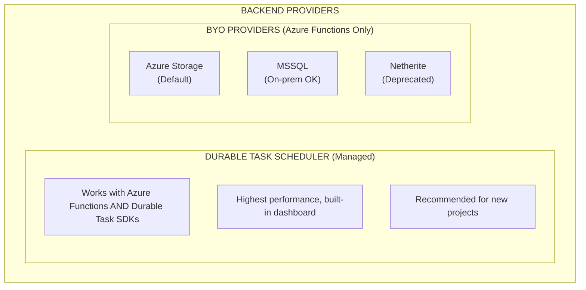
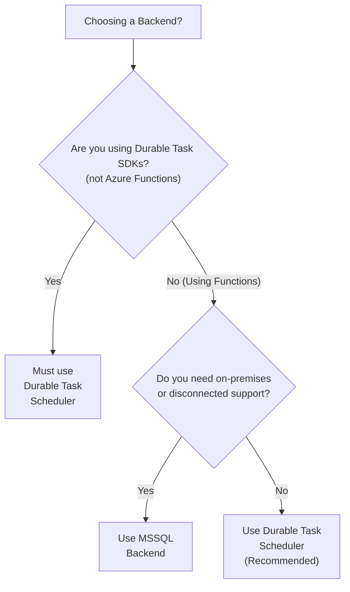

# Backend Providers
{: .no_toc }

## Table of contents
{: .no_toc .text-delta }

1. TOC
{:toc}

---

The Durable Task Framework requires a storage backend to persist orchestration state, manage queues, and coordinate workers. This guide covers the available backend providers and helps you choose the right one.

---

## Overview

| Provider | Type | Availability | Best For |
|----------|------|--------------|----------|
| **[Durable Task Scheduler](#durable-task-scheduler)** | Managed | Functions + SDKs | ✅ Recommended for most workloads |
| **[Azure Storage](#azure-storage)** | BYO | ⚠️ Functions Only | Legacy workloads, lowest setup |
| **[MSSQL](#microsoft-sql-server-mssql)** | BYO | ⚠️ Functions Only | On-premises, disconnected |
| **[Netherite](#netherite-deprecated)** | BYO | ⚠️ Functions Only | High-throughput (deprecated) |



> **Important**: Azure Storage, MSSQL, and Netherite backends are **only available with Azure Durable Functions**. The Durable Task SDKs only support the Durable Task Scheduler backend.

---

## Durable Task Scheduler

The **Durable Task Scheduler** is a fully managed, high-performance backend designed specifically for durable orchestrations. It's the recommended choice for both new projects and existing workloads.

### Key Benefits

| Benefit | Description |
|---------|-------------|
| **Highest Throughput** | Purpose-built for orchestrations, outperforms BYO options |
| **Managed Service** | No storage infrastructure to configure or manage |
| **Built-in Dashboard** | Real-time monitoring and debugging UI included |
| **Managed Identity** | Secure authentication without secrets |
| **Works Everywhere** | Azure Functions + Durable Task SDKs |

### Availability

| Platform | Support |
|----------|---------|
| Azure Durable Functions | ✅ Supported |
| Durable Task SDKs (.NET) | ✅ Supported |
| Durable Task SDKs (Python) | ✅ Supported |
| Durable Task SDKs (Java) | ✅ Supported |

### Configuration

**Azure Functions (host.json):**
```json
{
  "version": "2.0",
  "extensions": {
    "durableTask": {
      "storageProvider": {
        "type": "durabletaskscheduler",
        "connectionStringName": "DTS_CONNECTION_STRING"
      }
    }
  }
}
```

**Durable Task SDKs (.NET):**
```csharp
builder.Services.AddDurableTaskWorker(options =>
{
    options.AddOrchestrator<MyOrchestrator>();
    options.AddActivity<MyActivity>();
})
.UseDurableTaskScheduler(connectionString, taskHub);
```

**Durable Task SDKs (Python):**
```python
worker = DurableTaskSchedulerWorker(
    host_address=endpoint,
    secure_channel=True,
    taskhub=taskhub_name,
    token_credential=credential
)
```

---

## Azure Storage

Azure Storage is the original and default backend for Azure Durable Functions. It uses Azure Tables, Queues, and Blobs to store orchestration state.

> ⚠️ **Azure Functions Only**: This provider is not available with the standalone Durable Task SDKs.

### Key Characteristics

| Characteristic | Description |
|----------------|-------------|
| **Setup** | Simplest — uses existing Functions storage account |
| **Cost** | Pay-as-you-go based on storage operations |
| **Throughput** | Moderate — limited by Azure Storage IOPS |
| **Maturity** | Most battle-tested, longest history |
| **Local Dev** | Azurite emulator support |

### When to Use

- ✅ Simple workloads with moderate throughput
- ✅ Cost-sensitive scenarios
- ✅ When you want the simplest setup
- ❌ High-throughput requirements (consider DTS)
- ❌ Durable Task SDKs (not supported)

### Configuration

```json
{
  "extensions": {
    "durableTask": {
      "storageProvider": {
        "type": "AzureStorage",
        "connectionName": "AzureWebJobsStorage"
      }
    }
  }
}
```

### Storage Account Recommendations

- Use **General Purpose v1** storage accounts (lower cost for Durable Functions patterns)
- Avoid premium storage unless you have specific performance requirements
- Consider dedicated storage accounts for production task hubs

---

## Microsoft SQL Server (MSSQL)

The MSSQL backend stores all orchestration state in a SQL Server database. It's ideal for organizations with existing SQL infrastructure or disconnected environments.

> ⚠️ **Azure Functions Only**: This provider is not available with the standalone Durable Task SDKs.

### Key Characteristics

| Characteristic | Description |
|----------------|-------------|
| **Connectivity** | Works without Azure connectivity (on-premises) |
| **Portability** | Azure SQL, SQL Server, or on-premises |
| **Consistency** | ACID transactions, backup/restore support |
| **Throughput** | Moderate — depends on SQL Server capacity |
| **Encryption** | Native SQL Server encryption options |

### When to Use

- ✅ On-premises or disconnected environments
- ✅ Organizations with SQL Server expertise
- ✅ Strict data residency requirements
- ✅ Need for SQL-based reporting on orchestration data
- ❌ Serverless scaling scenarios
- ❌ Durable Task SDKs (not supported)

### Configuration

```json
{
  "extensions": {
    "durableTask": {
      "storageProvider": {
        "type": "mssql",
        "connectionStringName": "SQLDB_Connection"
      }
    }
  }
}
```

### Database Requirements

- SQL Server 2019 or later
- Azure SQL Database (any tier)
- SQL Server Developer Edition for local development

---

## Netherite (Deprecated)

> ⚠️ **Deprecated**: Support for Netherite ends March 31, 2028. Migrate to Durable Task Scheduler for high-throughput scenarios.

Netherite was designed by Microsoft Research for high-throughput orchestration workloads. It uses Azure Event Hubs and FASTER database technology.

> ⚠️ **Azure Functions Only**: This provider is not available with the standalone Durable Task SDKs.

### Key Characteristics

| Characteristic | Description |
|----------------|-------------|
| **Throughput** | Very high — optimized for Event Hubs |
| **Partitions** | Up to 32 data partitions |
| **Cost** | Event Hubs can be expensive at scale |
| **Status** | Deprecated — end of support March 2028 |

### Migration Path

If you're using Netherite, plan your migration to the Durable Task Scheduler:

1. **Evaluate** your current throughput requirements
2. **Test** with DTS in a staging environment
3. **Migrate** to a new task hub using DTS backend
4. **Decommission** Netherite infrastructure

---

## Comparison Matrix

| Feature | Durable Task Scheduler | Azure Storage | MSSQL | Netherite |
|---------|------------------------|---------------|-------|-----------|
| **Status** | ✅ Recommended | ✅ GA | ✅ GA | ⚠️ Deprecated |
| **Platforms** | Functions + SDKs | Functions Only | Functions Only | Functions Only |
| **Management** | Managed | BYO | BYO | BYO |
| **Throughput** | Very High | Moderate | Moderate | Very High |
| **Dashboard** | ✅ Built-in | ❌ None | ❌ None | ❌ None |
| **Managed Identity** | ✅ | ✅ | ⚠️ Limited | ❌ |
| **On-premises** | ❌ | ❌ | ✅ | ❌ |
| **Local Emulator** | ✅ Docker | ✅ Azurite | ✅ SQL Server | ✅ In-memory |
| **Entity Support** | ✅ Full | ✅ Full | ⚠️ Partial | ✅ Full |

---

## Choosing a Backend

### Decision Flowchart



### Quick Recommendation

| Scenario | Recommended Backend |
|----------|---------------------|
| **New project** | Durable Task Scheduler |
| **Existing Functions app** | Durable Task Scheduler (migrate) |
| **Durable Task SDKs** | Durable Task Scheduler (only option) |
| **On-premises/disconnected** | MSSQL |
| **Simple, low-throughput** | Azure Storage (existing) or DTS |
| **Using Netherite** | Migrate to Durable Task Scheduler |

---

## Migration Considerations

### Migrating to Durable Task Scheduler

When migrating from a BYO backend to Durable Task Scheduler:

1. **Create a new task hub** — Data cannot be migrated between backends
2. **Deploy new code** pointing to DTS backend
3. **Drain existing instances** on the old backend
4. **Decommission old backend** resources

### Code Changes

For Azure Functions, the main change is in `host.json`:

```json
// Before (Azure Storage)
{
  "extensions": {
    "durableTask": {
      "hubName": "MyTaskHub"
    }
  }
}

// After (Durable Task Scheduler)
{
  "extensions": {
    "durableTask": {
      "storageProvider": {
        "type": "durabletaskscheduler",
        "connectionStringName": "DTS_CONNECTION_STRING"
      }
    }
  }
}
```

**No orchestrator or activity code changes are required** — only configuration changes.

---

## Next Steps

- [Set up the Durable Task Scheduler →](../durable-task-scheduler/setup.md)
- [Learn about Task Hubs →](./task-hubs.md)
- [Understand Distributed Execution →](./distributed-execution.md)
