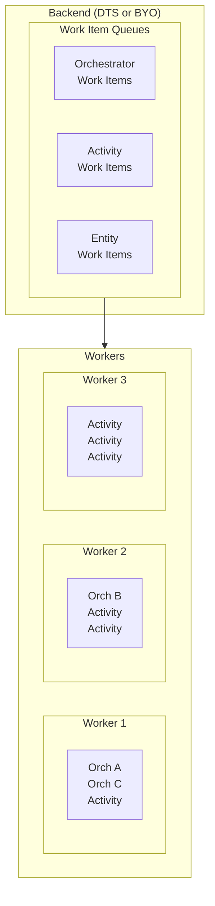
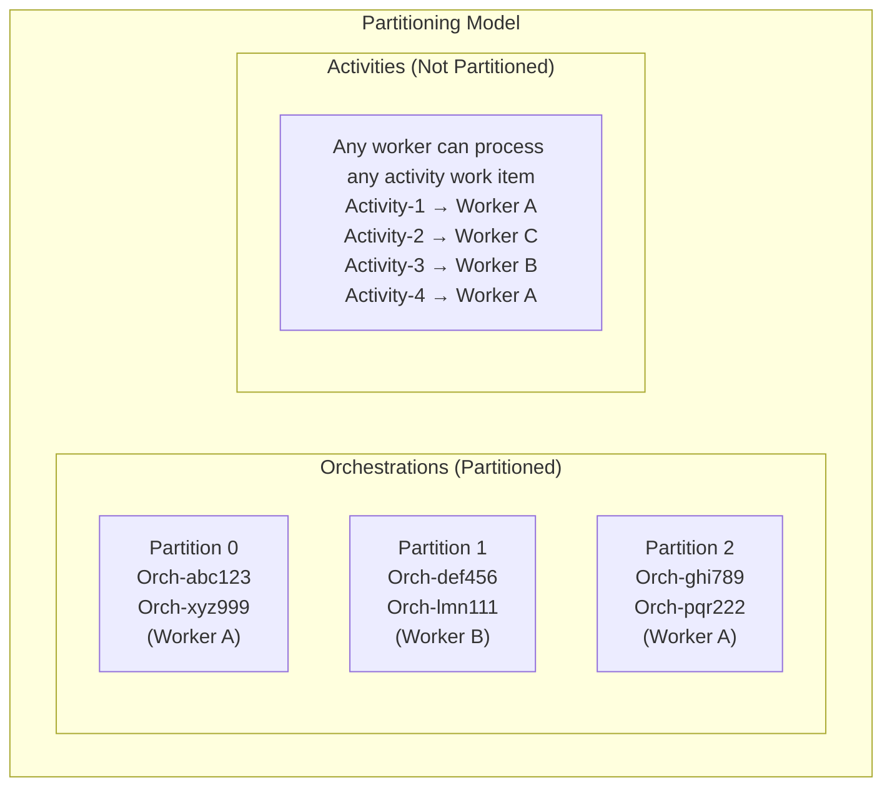
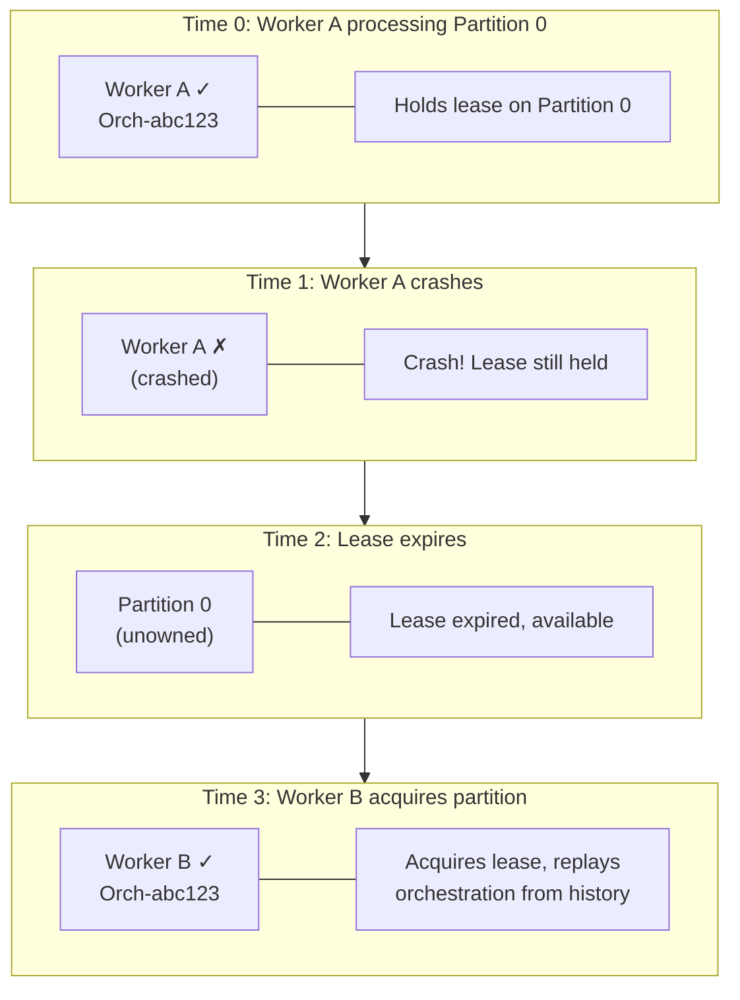

# Distributed Execution
{: .no_toc }

## Table of contents
{: .no_toc .text-delta }

1. TOC
{:toc}

---

The Durable Task Framework is designed to scale horizontally across multiple workers. This guide explains how orchestrations are distributed, how the system scales, and best practices for high-throughput scenarios.

---

## How Distribution Works

### Work Item Dispatching

The framework uses a **work item queue** model to distribute tasks across workers:



### Partitioning

**Orchestrations** are distributed using a partitioning scheme:

- Each orchestration instance is assigned to a **partition** based on its instance ID
- A partition is processed by **exactly one worker** at a time
- This ensures orchestrator replay is single-threaded per instance

**Activities** are distributed freely:

- Activity work items can be processed by **any available worker**
- This allows activities to scale out massively



---

## Scaling Behavior

### Azure Functions

In Azure Functions, scaling is automatic based on the hosting plan:

| Plan | Scaling Behavior |
|------|-----------------|
| **Consumption** | Auto-scales based on queue depth (0 to ~200 instances) |
| **Flex Consumption** | Faster scale-out, configurable limits |
| **Premium** | Pre-warmed instances, auto-scales |
| **Dedicated** | Manual scaling or App Service auto-scale rules |

The **Scale Controller** monitors work item queue depth and adds/removes worker instances.

### Durable Task SDKs

With the SDKs, you control scaling through your hosting platform:

| Platform | Scaling Method |
|----------|---------------|
| **Azure Container Apps** | KEDA-based scaling on HTTP or queue depth |
| **Kubernetes** | Horizontal Pod Autoscaler (HPA) or KEDA |
| **VMs** | Manual or VMSS auto-scale rules |

---

## Throughput Considerations

### Orchestrator Throughput

Orchestrator throughput is limited by:

1. **Number of partitions**: More partitions = more parallel orchestrator execution
2. **Replay time**: Larger histories = slower replay
3. **Backend latency**: Storage provider performance

**Maximizing orchestrator throughput:**
- Keep orchestrator code simple and fast
- Use `ContinueAsNew` to limit history size
- Avoid unnecessary activities (batch operations)

### Activity Throughput

Activity throughput scales more freely:

1. **Worker count**: More workers = more parallel activity execution
2. **Concurrency settings**: Configure max concurrent activities per worker
3. **Activity duration**: Shorter activities = higher throughput

**Maximizing activity throughput:**
- Keep activities focused and fast
- Use fan-out pattern for parallel work
- Configure appropriate concurrency limits

---

## Concurrency Configuration

### Azure Functions

Control concurrency in `host.json`:

```json
{
  "extensions": {
    "durableTask": {
      "maxConcurrentActivityFunctions": 10,
      "maxConcurrentOrchestratorFunctions": 10,
      "maxConcurrentEntityFunctions": 10
    }
  }
}
```

| Setting | Description | Default |
|---------|-------------|---------|
| `maxConcurrentActivityFunctions` | Max activities per worker | 10× processor count |
| `maxConcurrentOrchestratorFunctions` | Max orchestrators per worker | 10× processor count |
| `maxConcurrentEntityFunctions` | Max entities per worker | 10× processor count |

### Durable Task SDKs

Control concurrency in worker configuration:

```csharp
builder.Services.AddDurableTaskWorker(options =>
{
    options.MaxConcurrentOrchestrationRuns = 10;
    options.MaxConcurrentActivityExecutions = 20;
})
.UseDurableTaskScheduler(connectionString, taskHub);
```

---

## High Availability

The Durable Task Framework provides built-in high availability:

### Automatic Failover

If a worker crashes:

1. **Lease expires**: The partition lease held by the failed worker expires
2. **Another worker acquires**: A healthy worker takes over the partition
3. **Replay resumes**: The orchestration replays from the last checkpoint
4. **Execution continues**: Work proceeds as if nothing happened



### State Durability

All orchestration state is persisted to the backend:

- **Event history**: Complete record of all events
- **Checkpoint data**: Saved at each await point
- **Activity results**: Stored for replay

This means:
- ✅ Worker crashes don't lose progress
- ✅ Backend failures are the only data loss risk
- ✅ Scale-in doesn't interrupt running orchestrations

---

## Performance Best Practices

### 1. Minimize History Size

Large histories slow down replay:

```csharp
// ❌ Bad: History grows unboundedly
while (true)
{
    await context.CallActivityAsync("DoWork", null);
    await context.CreateTimer(context.CurrentUtcDateTime.AddMinutes(5), default);
}

// ✅ Good: Use ContinueAsNew to reset history
await context.CallActivityAsync("DoWork", null);
await context.CreateTimer(context.CurrentUtcDateTime.AddMinutes(5), default);
context.ContinueAsNew(null);
```

### 2. Batch Operations

Reduce the number of activities:

```csharp
// ❌ Bad: 1000 activities
foreach (var item in items)
{
    await context.CallActivityAsync("ProcessItem", item);
}

// ✅ Good: 1 activity with batching
await context.CallActivityAsync("ProcessItems", items);
```

### 3. Use Fan-Out for Parallel Work

Maximize throughput with parallel execution:

```csharp
// ✅ Good: Parallel fan-out
var tasks = items.Select(item => 
    context.CallActivityAsync("ProcessItem", item));
await Task.WhenAll(tasks);
```

### 4. Keep Payloads Small

Large inputs/outputs increase latency:

```csharp
// ❌ Bad: Large payload
await context.CallActivityAsync("ProcessFile", largeFileContent);

// ✅ Good: Pass reference
await context.CallActivityAsync("ProcessFile", blobUrl);
```

### 5. Choose Appropriate Concurrency

Balance throughput with downstream capacity:

```json
{
  "extensions": {
    "durableTask": {
      "maxConcurrentActivityFunctions": 20,
      "maxConcurrentOrchestratorFunctions": 5
    }
  }
}
```

---

## Monitoring Distributed Execution

### Key Metrics

| Metric | What It Indicates |
|--------|------------------|
| **Queue depth** | Backlog of pending work |
| **Worker count** | Number of active workers |
| **Latency** | Time from scheduling to execution |
| **Throughput** | Operations per second |
| **Failure rate** | Percentage of failed operations |

### Dashboard

The Durable Task Scheduler dashboard provides:

- Real-time orchestration status
- Worker health monitoring
- Queue depth visibility
- Historical execution data

---

## Troubleshooting

### High Latency

| Symptom | Possible Cause | Solution |
|---------|---------------|----------|
| Slow orchestrator execution | Large history | Use `ContinueAsNew` |
| Slow activity execution | Activity code is slow | Optimize activity logic |
| Growing queue backlog | Insufficient workers | Increase worker count |
| Inconsistent latency | Backend throttling | Check backend metrics |

### Scaling Issues

| Symptom | Possible Cause | Solution |
|---------|---------------|----------|
| Not scaling up | Scale controller delay | Wait or use Premium plan |
| Not scaling down | Long-running activities | Check activity timeout |
| Uneven load | Partition imbalance | Review instance ID distribution |

---

## Next Steps

- [Learn about Backend Providers →](./backend-providers.md)
- [Configure Task Hubs →](./task-hubs.md)
- [View Architecture Guides →](../architecture/index.md)
