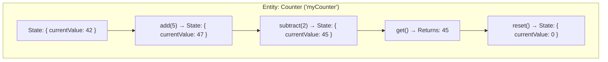

# Entity Functions
{: .no_toc }

## Table of contents
{: .no_toc .text-delta }

1. TOC
{:toc}

---

Entity functions (also called **Durable Entities**) provide a way to manage small pieces of distributed state. They're perfect for scenarios where you need stateful actors that can process operations one at a time.

---

## What is an Entity?

An entity function is a stateful object that:

- **Manages state explicitly** — You define what state the entity holds
- **Processes operations sequentially** — Operations are processed one at a time, avoiding race conditions
- **Is addressable by ID** — Each entity has a unique identifier
- **Persists automatically** — State is saved without manual intervention



---

## Entities vs Orchestrations

| Aspect | Orchestrations | Entities |
|--------|----------------|----------|
| **State** | Implicit (via history) | Explicit (in-memory) |
| **Lifetime** | Ends when complete | Lives until deleted |
| **Concurrency** | Multiple instances can run | Single-threaded per entity |
| **Use case** | Workflows, processes | Aggregators, stateful actors |

---

## Code Examples

### C# (Class-Based Syntax)

```csharp
using Microsoft.Azure.Functions.Worker;
using Microsoft.DurableTask.Entities;

public class Counter : TaskEntity<int>
{
    public int CurrentValue { get; set; }

    public void Add(int amount)
    {
        CurrentValue += amount;
    }

    public void Subtract(int amount)
    {
        CurrentValue -= amount;
    }

    public int Get()
    {
        return CurrentValue;
    }

    public void Reset()
    {
        CurrentValue = 0;
    }

    [Function(nameof(Counter))]
    public static Task RunEntityAsync([EntityTrigger] TaskEntityDispatcher dispatcher)
    {
        return dispatcher.DispatchAsync<Counter>();
    }
}
```

### C# (Function-Based Syntax)

```csharp
using Microsoft.Azure.Functions.Worker;
using Microsoft.DurableTask.Entities;

public static class CounterEntity
{
    [Function(nameof(Counter))]
    public static Task Counter([EntityTrigger] TaskEntityDispatcher dispatcher)
    {
        return dispatcher.DispatchAsync(operation =>
        {
            int currentValue = operation.State.GetState<int>();
            
            switch (operation.Name.ToLowerInvariant())
            {
                case "add":
                    int addAmount = operation.GetInput<int>();
                    operation.State.SetState(currentValue + addAmount);
                    break;
                    
                case "subtract":
                    int subAmount = operation.GetInput<int>();
                    operation.State.SetState(currentValue - subAmount);
                    break;
                    
                case "get":
                    return currentValue;
                    
                case "reset":
                    operation.State.SetState(0);
                    break;
            }
            
            return null;
        });
    }
}
```

### Python

```python
import azure.durable_functions as df
import logging

myApp = df.DFApp()

@myApp.entity_trigger(context_name="context")
def counter_entity(context: df.DurableEntityContext):
    current_value = context.get_state(lambda: 0)
    operation = context.operation_name
    
    if operation == "add":
        amount = context.get_input()
        current_value += amount
    elif operation == "subtract":
        amount = context.get_input()
        current_value -= amount
    elif operation == "get":
        context.set_result(current_value)
    elif operation == "reset":
        current_value = 0
    
    context.set_state(current_value)
```

---

## Accessing Entities

### From Orchestrator Functions

Orchestrators can both **call** (synchronous) and **signal** (asynchronous) entities:

```csharp
// C# - From an orchestrator
[Function(nameof(CounterOrchestrator))]
public static async Task<int> CounterOrchestrator(
    [OrchestrationTrigger] TaskOrchestrationContext context)
{
    var entityId = new EntityInstanceId("Counter", "myCounter");
    
    // Signal (fire-and-forget)
    await context.Entities.SignalEntityAsync(entityId, "add", 5);
    
    // Call (wait for result)
    int currentValue = await context.Entities.CallEntityAsync<int>(
        entityId, 
        "get"
    );
    
    return currentValue;
}
```

```python
# Python - From an orchestrator
@myApp.orchestration_trigger(context_name="context")
def counter_orchestrator(context: df.DurableOrchestrationContext):
    entity_id = df.EntityId("counter_entity", "myCounter")
    
    # Signal (fire-and-forget)
    context.signal_entity(entity_id, "add", 5)
    
    # Call (wait for result)
    current_value = yield context.call_entity(entity_id, "get")
    
    return current_value
```

### From Client Functions

Clients can **signal** entities but cannot call them synchronously:

```csharp
// C# - From a client function
[Function("AddToCounter")]
public static async Task<HttpResponseData> AddToCounter(
    [HttpTrigger(AuthorizationLevel.Anonymous, "post")] HttpRequestData req,
    [DurableClient] DurableTaskClient client)
{
    var entityId = new EntityInstanceId("Counter", "myCounter");
    
    // Signal the entity
    await client.Entities.SignalEntityAsync(entityId, "add", 10);
    
    // Read the entity state
    var state = await client.Entities.GetEntityAsync<int>(entityId);
    
    var response = req.CreateResponse(HttpStatusCode.OK);
    await response.WriteAsJsonAsync(new { value = state?.State });
    return response;
}
```

---

## Entity Identity

Each entity is uniquely identified by an **Entity ID** consisting of:

1. **Entity Name**: The name of the entity function (e.g., "Counter")
2. **Entity Key**: A unique identifier for this instance (e.g., "user-123")

```csharp
// Create an entity ID
var entityId = new EntityInstanceId("Counter", "user-123");
```

```python
# Python
entity_id = df.EntityId("Counter", "user-123")
```

---

## Common Entity Patterns

### Shopping Cart

```csharp
public class ShoppingCart : TaskEntity<List<CartItem>>
{
    public List<CartItem> Items { get; set; } = new();

    public void AddItem(CartItem item)
    {
        var existing = Items.FirstOrDefault(i => i.ProductId == item.ProductId);
        if (existing != null)
        {
            existing.Quantity += item.Quantity;
        }
        else
        {
            Items.Add(item);
        }
    }

    public void RemoveItem(string productId)
    {
        Items.RemoveAll(i => i.ProductId == productId);
    }

    public CartSummary GetSummary()
    {
        return new CartSummary
        {
            ItemCount = Items.Sum(i => i.Quantity),
            TotalPrice = Items.Sum(i => i.Price * i.Quantity)
        };
    }

    public void Clear()
    {
        Items.Clear();
    }

    [Function(nameof(ShoppingCart))]
    public static Task RunEntityAsync([EntityTrigger] TaskEntityDispatcher dispatcher)
    {
        return dispatcher.DispatchAsync<ShoppingCart>();
    }
}
```

### Rate Limiter

```csharp
public class RateLimiter : TaskEntity<RateLimiterState>
{
    private readonly int _maxRequests = 100;
    private readonly TimeSpan _window = TimeSpan.FromMinutes(1);

    public bool TryAcquire()
    {
        var now = DateTime.UtcNow;
        
        // Clean old entries
        State.Requests.RemoveAll(r => now - r > _window);
        
        if (State.Requests.Count >= _maxRequests)
        {
            return false;
        }
        
        State.Requests.Add(now);
        return true;
    }

    public int GetRemainingQuota()
    {
        var now = DateTime.UtcNow;
        State.Requests.RemoveAll(r => now - r > _window);
        return Math.Max(0, _maxRequests - State.Requests.Count);
    }
}
```

---

## Entity Best Practices

### ✅ Do

- Keep entity state small (ideally under 64 KB)
- Use entities for aggregation and coordination
- Design idempotent operations when possible
- Use unique, meaningful entity keys

### ❌ Don't

- Store large amounts of data in entities
- Use entities for complex workflow logic (use orchestrators)
- Access entities directly from multiple threads
- Rely on entity state for long-term data storage

---

## Availability

Entity functions are available in:

| Language | Support |
|----------|---------|
| C# | ✅ Full support (Durable Functions 2.0+) |
| JavaScript | ✅ Full support (Durable Functions 2.0+) |
| Python | ✅ Full support (Durable Functions 2.0+) |
| Java | ⚠️ Limited support |
| PowerShell | ⚠️ Limited support |

---

## Next Steps

- [Learn about State Management →](./state-management.md)
- [Explore the Aggregator Pattern →](../patterns/aggregator.md)
- [View Code Samples →](../sdks/samples.md)
