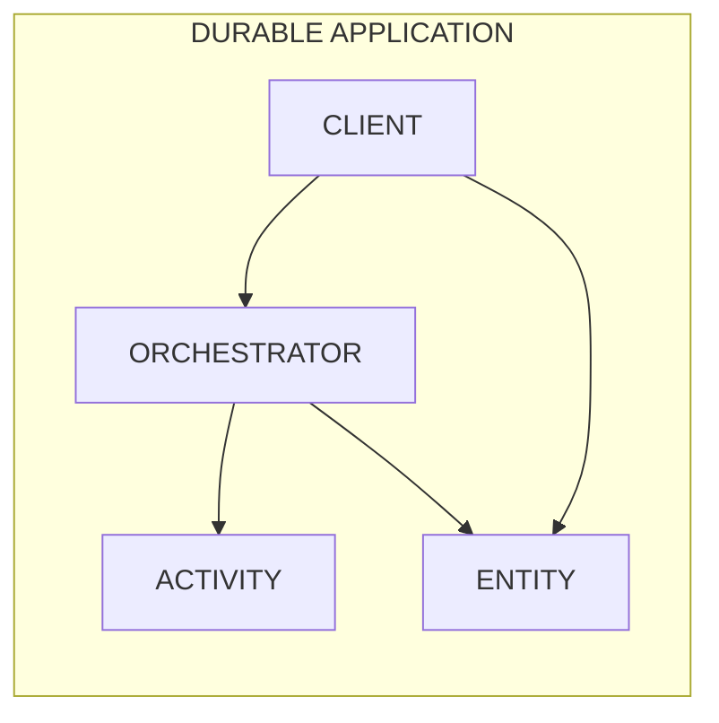
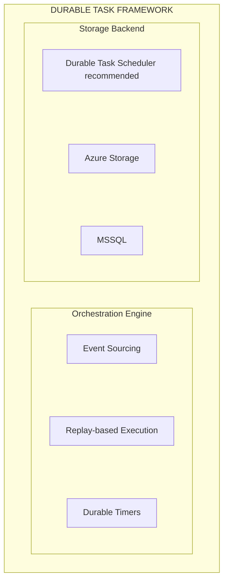
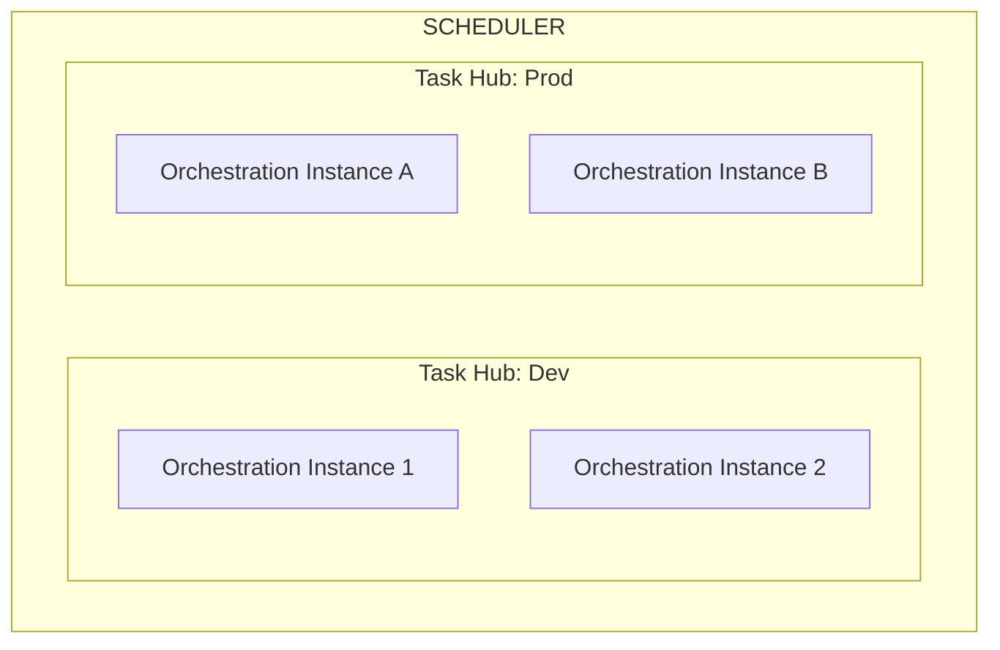
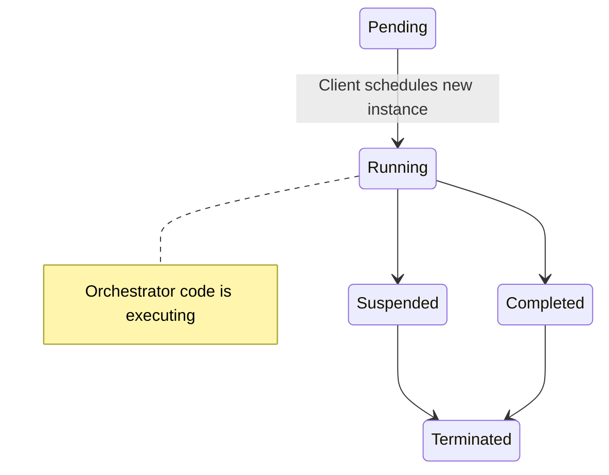

# Core Concepts
{: .no_toc }

This section covers the fundamental concepts you need to understand when working with Azure Durable orchestrations. These concepts apply whether you're using Durable Functions or the Durable Task SDKs.
{: .fs-6 .fw-300 }

---

## Overview

Azure Durable orchestrations are built around four core function types:



| Function Type | Purpose |
|--------------|---------|
| **[Orchestrator](./orchestrators.md)** | Coordinates the execution of activities and sub-orchestrations |
| **[Activity](./activities.md)** | Performs the actual work (database calls, API requests, computations) |
| **[Entity](./entities.md)** | Manages small pieces of state with explicit operations |
| **Client** | Starts and manages orchestration instances (see [Instance Management](./instance-management.md)) |

---

## The Durable Task Framework

Behind the scenes, all Azure Durable orchestrations are powered by the **Durable Task Framework** — an open-source library originally developed by Microsoft for building reliable workflows in code.



### Key Principles

1. **Event Sourcing**: All orchestration state changes are stored as a sequence of events
2. **Deterministic Replay**: Orchestrator code can be replayed from history to recover state
3. **Automatic Checkpointing**: State is automatically saved at key points during execution
4. **At-Least-Once Execution**: Activities are guaranteed to execute at least once

---

## Task Hubs

A **task hub** is a logical container for orchestration and entity instances. Think of it as a namespace that:

- Groups related orchestrations together
- Provides isolation between different workloads
- Enables separate monitoring and access control



### Common Task Hub Strategies

- **Per Environment**: Create separate task hubs for dev, staging, and production
- **Per Team**: Allow different teams to have isolated workloads
- **Per Application**: Group all orchestrations for a single app together

---

## Orchestration Lifecycle

Every orchestration instance goes through a defined lifecycle:



| State | Description |
|-------|-------------|
| **Pending** | Orchestration has been scheduled but not yet started |
| **Running** | Orchestrator function is actively executing |
| **Suspended** | Orchestration is waiting (for an activity, timer, or event) |
| **Completed** | Orchestration finished successfully |
| **Failed** | Orchestration encountered an unhandled exception |
| **Terminated** | Orchestration was explicitly terminated |

---

## Determinism Requirements

Orchestrator functions must be **deterministic** — they must produce the same results when replayed. This is essential because the framework may replay your orchestrator code multiple times during execution.

### ✅ Safe Operations

- Calling activities via the orchestration context
- Creating durable timers
- Waiting for external events
- Calling sub-orchestrations
- Getting the current orchestration time

### ❌ Unsafe Operations

- Generating random numbers
- Reading environment variables
- Making direct HTTP calls
- Using `DateTime.Now` or `DateTime.UtcNow`
- Using `Thread.Sleep` or `Task.Delay` directly

### Example: Safe vs Unsafe

```csharp
// ❌ UNSAFE - Non-deterministic
public async Task<string> UnsafeOrchestrator(TaskOrchestrationContext context)
{
    var random = new Random();
    var delay = random.Next(1000, 5000); // Different on replay!
    await Task.Delay(delay);             // Not tracked by framework
    return DateTime.Now.ToString();      // Different on replay!
}

// ✅ SAFE - Deterministic
public async Task<string> SafeOrchestrator(TaskOrchestrationContext context)
{
    // Use activity for non-deterministic work
    var delay = await context.CallActivityAsync<int>("GetRandomDelay");
    
    // Use durable timer
    await context.CreateTimer(context.CurrentUtcDateTime.AddMilliseconds(delay));
    
    // Use orchestration time
    return context.CurrentUtcDateTime.ToString();
}
```

---

## In This Section

### Getting Started
- **[App Hosting](./app-hosting.md)** — Azure Functions vs Durable Task SDKs, .NET In-Process vs Isolated
- **[Orchestrators](./orchestrators.md)** — Learn how orchestrator functions coordinate workflows
- **[Activities](./activities.md)** — Understand how activities perform the actual work
- **[Code Constraints](./code-constraints.md)** — Critical rules for deterministic orchestrator code

### Core Features
- **[Entities](./entities.md)** — Stateful actors for managing distributed state
- **[Instance Management](./instance-management.md)** — Start, query, terminate, and purge instances
- **[Error Handling](./error-handling.md)** — Handle exceptions, retries, and compensation
- **[Versioning](./versioning.md)** — Strategies for updating orchestration code

### Infrastructure
- **[Task Hubs](./task-hubs.md)** — Logical containers for isolation and management
- **[Backend Providers](./backend-providers.md)** — Choose the right storage backend (DTS, Azure Storage, MSSQL)
- **[Distributed Execution](./distributed-execution.md)** — Scaling, partitioning, and high availability

### Advanced Topics
- **[State Management](./state-management.md)** — Deep dive into event sourcing and replay
- **[Data Persistence](./data-persistence.md)** — Serialization, payload sizes, and versioning
- **[Framework vs SDKs](./framework-vs-sdk.md)** — Understand the difference between DTFx and the client libraries

---

## Next Steps

- [Explore orchestration patterns →](../patterns/index.md)
- [Get started with Durable Functions →](../durable-functions/overview.md)
- [Learn about the Durable Task Scheduler →](../durable-task-scheduler/overview.md)
