# State Management
{: .no_toc }

## Table of contents
{: .no_toc .text-delta }

1. TOC
{:toc}

---

Understanding how state is managed is crucial for building reliable durable orchestrations. This section explains how the Durable Task Framework persists and recovers orchestration state.

---

## Event Sourcing Model

The Durable Task Framework uses **event sourcing** to manage orchestration state. Instead of storing the current state directly, it stores a log of all events that have occurred.


### Benefits of Event Sourcing

- **Complete Audit Trail**: Every action is recorded
- **Replay Capability**: State can be reconstructed by replaying events
- **Debugging**: Full visibility into what happened and when
- **Recovery**: Automatic resume from the last checkpoint

---

## Checkpointing

**Checkpointing** is the process of saving the current orchestration state to durable storage. Checkpoints occur automatically:

1. When an orchestrator awaits an activity
2. When an orchestrator awaits a timer
3. When an orchestrator awaits an external event
4. When an orchestrator completes


---

## Replay Behavior

When an orchestration resumes after a checkpoint, the framework **replays** the orchestrator function from the beginning. It uses the stored history to skip already-completed work.


### The `IsReplaying` Property

You can detect replay mode using the context's `IsReplaying` property:

```csharp
[Function(nameof(MyOrchestrator))]
public static async Task<string> MyOrchestrator(
    [OrchestrationTrigger] TaskOrchestrationContext context,
    ILogger log)
{
    // This log will only appear once, not during replays
    if (!context.IsReplaying)
    {
        log.LogInformation("Starting orchestration {InstanceId}", context.InstanceId);
    }
    
    var result = await context.CallActivityAsync<string>("MyActivity", null);
    return result;
}
```

---

## Storage Backends

The Durable Task Framework supports multiple storage backends for persisting orchestration state:

### Durable Task Scheduler (Recommended)

The **Durable Task Scheduler** is a fully managed backend that provides:

- ✅ Highest throughput
- ✅ Built-in monitoring dashboard
- ✅ Automatic scaling
- ✅ No storage management required


### Azure Storage (BYO)

The default "bring your own" storage option using Azure Storage:

- Azure Table Storage for history
- Azure Blob Storage for large payloads
- Azure Queue Storage for work items


### MSSQL (BYO)

SQL Server storage option for organizations with existing SQL infrastructure:

- Single database for all orchestration data
- ACID transactions for consistency
- Standard SQL tooling for management

---

## History Management

### History Table Structure

The orchestration history contains events like:

| Event Type | Description |
|------------|-------------|
| `OrchestratorStarted` | Orchestration instance began executing |
| `ExecutionStarted` | A new execution of the orchestrator started |
| `TaskScheduled` | An activity was scheduled |
| `TaskCompleted` | An activity completed successfully |
| `TaskFailed` | An activity failed |
| `TimerCreated` | A durable timer was scheduled |
| `TimerFired` | A durable timer triggered |
| `EventRaised` | An external event was received |
| `OrchestratorCompleted` | Orchestration finished successfully |
| `OrchestratorFailed` | Orchestration failed with an exception |

### History Size Considerations

Large histories can impact performance:

- **Problem**: Long-running orchestrations accumulate large histories
- **Solution**: Use `ContinueAsNew` to restart with fresh history

```csharp
[Function(nameof(PeriodicCleanup))]
public static async Task PeriodicCleanup(
    [OrchestrationTrigger] TaskOrchestrationContext context)
{
    // Track iteration count in input
    var iteration = context.GetInput<int>();
    
    // Do work
    await context.CallActivityAsync("PerformCleanup", null);
    
    // Wait for next interval
    await context.CreateTimer(context.CurrentUtcDateTime.AddHours(1));
    
    // Restart with new iteration (clears history)
    context.ContinueAsNew(iteration + 1);
}
```

---

## Data Persistence & Serialization

The Durable Task Framework automatically handles the serialization and persistence of all data passed between functions.

### Serialization

- **Inputs & Outputs**: All inputs to orchestrators/activities and all outputs returned by them are serialized to JSON.
- **Exceptions**: Exceptions thrown by activities are also serialized and can be caught in the orchestrator.
- **Custom Types**: You can use custom classes/records, provided they are JSON-serializable.

> **Note**: Circular references in objects will cause serialization failures.

### Data Storage

Serialized data is stored in the configured storage backend.

- **Small Payloads**: Stored directly in the orchestration history (e.g., Azure Table Storage).
- **Large Payloads**: Automatically offloaded to blob storage (if supported by the provider) to avoid hitting size limits. The history then contains a reference (URL) to the blob.

### Best Practices

1. **Keep Payloads Small**: Large payloads increase latency and storage costs.
2. **Use References**: Instead of passing a 10MB file content, pass a URL to where the file is stored.
3. **Versioning**: Be careful when changing the structure of custom types used in inputs/outputs, as this can break replay for in-flight instances.

---

## Durability Guarantees

### Exactly-Once Orchestrator Execution

The framework ensures that orchestrator logic executes exactly once (even though it may replay many times):

- Activities are scheduled exactly once
- Timers fire exactly once
- External events are processed exactly once

### At-Least-Once Activity Execution

Activities may execute more than once in rare failure scenarios:

- If an activity completes but the completion message is lost
- If there's a failover during activity execution

**Design activities to be idempotent when possible.**

---

## State Recovery Scenarios

### Scenario 1: Process Restart

```mermaid
flowchart TB
    subgraph Before["Before Restart"]
        BR["Orchestrator running<br/>Activity1 completed ✓<br/>Activity2 in progress..."]
    end
    
    Crash["💥 Process crashes"]
    
    subgraph After["After Restart"]
        AR["Orchestrator replays<br/>Activity1 result from history ✓<br/>Activity2 result from history ✓ (done!)<br/>Continues with Activity3"]
    end
    
    Before --> Crash --> After
```



### Scenario 2: Scale-Out


---

## Best Practices for State Management

### ✅ Do

- Keep orchestrator logic simple to minimize history size
- Use `ContinueAsNew` for eternal orchestrations
- Choose the right storage backend for your needs
- Monitor history size for long-running orchestrations

### ❌ Don't

- Store large objects as orchestration input/output (use external storage)
- Create infinite loops without `ContinueAsNew`
- Assume activities run only once (design for idempotency)
- Ignore history growth in long-running scenarios

---

## Next Steps

- [Learn about the Durable Task Scheduler →](../durable-task-scheduler/overview.md)
- [Explore Storage Provider Options →](../comparison/advantages.md)
- [View Architecture Guides →](../architecture/index.md)
