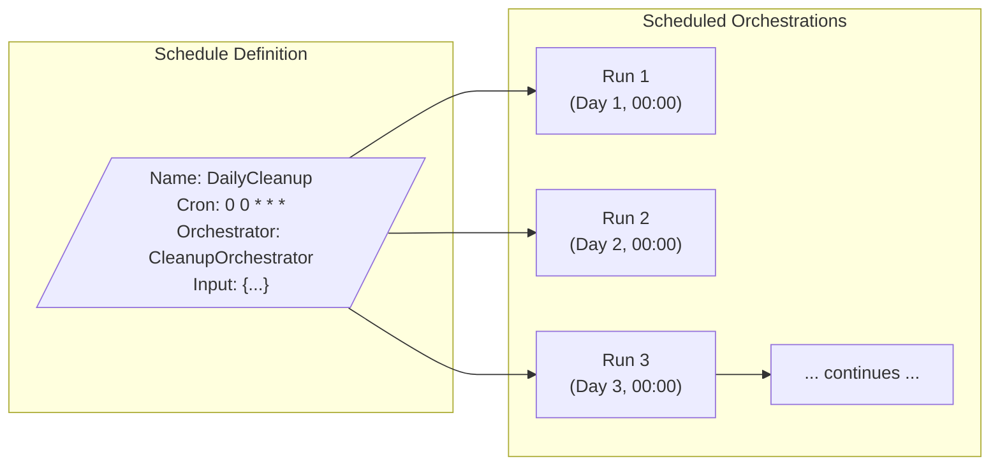

# Schedules
{: .no_toc }

## Table of contents
{: .no_toc .text-delta }

1. TOC
{:toc}

---

Schedules allow you to define recurring orchestrations that run on a predefined cadence. This is useful for batch jobs, periodic maintenance tasks, data synchronization, and other time-based workflows.

{: .note }
> Schedule support is currently available in the **.NET SDK only**. For other languages, see the [Other Languages](#other-languages) section below.

---

## Overview

Schedules provide a way to:

- **Define recurring orchestrations** with cron expressions
- **Manage lifecycle** (pause, resume, delete)
- **Track execution history** for scheduled runs
- **Handle missed runs** with configurable policies



---

## Creating a Schedule

### Basic Schedule

```csharp
using Microsoft.DurableTask.ScheduledTasks;

// Create a schedule client
var scheduleClient = serviceProvider.GetRequiredService<ScheduleClient>();

// Define the schedule
var schedule = new ScheduleCreationOptions
{
    ScheduleId = "daily-cleanup",
    OrchestrationName = "CleanupOrchestrator",
    CronExpression = "0 0 * * *",  // Daily at midnight
    Input = new CleanupInput { RetentionDays = 30 }
};

// Create the schedule
await scheduleClient.CreateScheduleAsync(schedule);
```

### Schedule with Options

```csharp
var schedule = new ScheduleCreationOptions
{
    ScheduleId = "hourly-sync",
    OrchestrationName = "DataSyncOrchestrator",
    CronExpression = "0 * * * *",  // Every hour
    Input = new SyncInput { Source = "db1", Target = "db2" },
    
    // Optional settings
    StartAt = DateTimeOffset.UtcNow.AddHours(1),  // Start in 1 hour
    EndAt = DateTimeOffset.UtcNow.AddDays(30),    // End after 30 days
    TimeZone = TimeZoneInfo.FindSystemTimeZoneById("America/Los_Angeles"),
    
    // Missed run policy
    CatchUpMissedRuns = true,  // Run missed schedules when service recovers
    MaxCatchUpRuns = 5         // Limit catch-up runs
};
```

---

## Cron Expression Format

Schedules use standard cron expressions:

```
┌───────────── minute (0 - 59)
│ ┌───────────── hour (0 - 23)
│ │ ┌───────────── day of month (1 - 31)
│ │ │ ┌───────────── month (1 - 12)
│ │ │ │ ┌───────────── day of week (0 - 6) (Sunday = 0)
│ │ │ │ │
* * * * *
```

### Common Examples

| Expression | Description |
|------------|-------------|
| `0 * * * *` | Every hour at minute 0 |
| `0 0 * * *` | Daily at midnight |
| `0 0 * * 0` | Weekly on Sunday at midnight |
| `0 0 1 * *` | Monthly on the 1st at midnight |
| `*/15 * * * *` | Every 15 minutes |
| `0 9-17 * * 1-5` | Every hour 9 AM - 5 PM, Mon-Fri |
| `0 0 1,15 * *` | 1st and 15th of each month |

---

## Managing Schedules

### List Schedules

```csharp
var schedules = await scheduleClient.ListSchedulesAsync();

foreach (var schedule in schedules)
{
    Console.WriteLine($"Schedule: {schedule.ScheduleId}");
    Console.WriteLine($"  Status: {schedule.Status}");
    Console.WriteLine($"  Next Run: {schedule.NextRunTime}");
    Console.WriteLine($"  Last Run: {schedule.LastRunTime}");
}
```

### Get Schedule Details

```csharp
var schedule = await scheduleClient.GetScheduleAsync("daily-cleanup");

Console.WriteLine($"Schedule ID: {schedule.ScheduleId}");
Console.WriteLine($"Cron: {schedule.CronExpression}");
Console.WriteLine($"Status: {schedule.Status}");
Console.WriteLine($"Next Run: {schedule.NextRunTime}");
Console.WriteLine($"Run Count: {schedule.TotalRunCount}");
```

### Pause and Resume

```csharp
// Pause a schedule
await scheduleClient.PauseScheduleAsync("daily-cleanup");

// Resume a schedule
await scheduleClient.ResumeScheduleAsync("daily-cleanup");
```

### Delete Schedule

```csharp
await scheduleClient.DeleteScheduleAsync("daily-cleanup");
```

---

## Sample Application

A complete sample application demonstrating schedules is available:

**[ScheduleWebApp Sample](https://github.com/Azure-Samples/Durable-Task-Scheduler/tree/main/samples/durable-task-sdks/dotnet/ScheduleWebApp)**

This sample shows:
- Creating and managing schedules via a web API
- Configuring schedule options
- Viewing schedule history
- Handling missed runs

### Running the Sample

```bash
# Clone the repository
git clone https://github.com/Azure-Samples/Durable-Task-Scheduler.git

# Navigate to the sample
cd Durable-Task-Scheduler/samples/durable-task-sdks/dotnet/ScheduleWebApp

# Start the emulator
docker run -d -p 8080:8080 mcr.microsoft.com/dts/dts-emulator:latest

# Run the application
dotnet run
```

---

## Integration with Web APIs

### ASP.NET Core Example

```csharp
// Program.cs
var builder = WebApplication.CreateBuilder(args);

// Add Durable Task services
builder.Services.AddDurableTaskClient()
    .UseDurableTaskScheduler(connectionString, taskHub);

builder.Services.AddDurableTaskWorker(options =>
{
    options.AddOrchestrator<CleanupOrchestrator>();
    options.AddActivity<CleanupActivity>();
})
.UseDurableTaskScheduler(connectionString, taskHub);

// Add schedule client
builder.Services.AddScheduleClient()
    .UseDurableTaskScheduler(connectionString, taskHub);

var app = builder.Build();

// API endpoints
app.MapPost("/schedules", async (
    ScheduleClient client, 
    CreateScheduleRequest request) =>
{
    var options = new ScheduleCreationOptions
    {
        ScheduleId = request.Id,
        OrchestrationName = request.OrchestratorName,
        CronExpression = request.Cron,
        Input = request.Input
    };
    
    await client.CreateScheduleAsync(options);
    return Results.Created($"/schedules/{request.Id}", null);
});

app.MapGet("/schedules", async (ScheduleClient client) =>
{
    var schedules = await client.ListSchedulesAsync();
    return Results.Ok(schedules);
});

app.MapGet("/schedules/{id}", async (
    ScheduleClient client, 
    string id) =>
{
    var schedule = await client.GetScheduleAsync(id);
    return schedule is not null 
        ? Results.Ok(schedule) 
        : Results.NotFound();
});

app.MapDelete("/schedules/{id}", async (
    ScheduleClient client, 
    string id) =>
{
    await client.DeleteScheduleAsync(id);
    return Results.NoContent();
});

app.Run();
```

---

## Schedule Orchestrator Pattern

A common pattern is to have a generic orchestrator that schedules invoke:

```csharp
[DurableTask(nameof(CleanupOrchestrator))]
public class CleanupOrchestrator : TaskOrchestrator<CleanupInput, CleanupResult>
{
    public override async Task<CleanupResult> RunAsync(
        TaskOrchestrationContext context,
        CleanupInput input)
    {
        var logger = context.CreateReplaySafeLogger<CleanupOrchestrator>();
        logger.LogInformation("Starting cleanup for retention: {Days} days", 
            input.RetentionDays);
        
        // Get items to clean up
        var items = await context.CallActivityAsync<List<string>>(
            nameof(GetExpiredItemsActivity),
            input.RetentionDays
        );
        
        logger.LogInformation("Found {Count} items to clean up", items.Count);
        
        // Clean up in parallel
        var tasks = items.Select(item =>
            context.CallActivityAsync<bool>(nameof(DeleteItemActivity), item)
        );
        
        var results = await Task.WhenAll(tasks);
        var deletedCount = results.Count(r => r);
        
        return new CleanupResult
        {
            TotalFound = items.Count,
            Deleted = deletedCount,
            CompletedAt = context.CurrentUtcDateTime
        };
    }
}
```

---

## Other Languages

Schedule support for other languages is planned. Vote and share your use cases on the GitHub repositories:

| Language | Repository |
|----------|------------|
| **Python** | [microsoft/durabletask-python](https://github.com/microsoft/durabletask-python/issues) |
| **Java** | [microsoft/durabletask-java](https://github.com/microsoft/durabletask-java/issues) |
| **JavaScript** | [Azure/azure-functions-durable-js](https://github.com/Azure/azure-functions-durable-js/issues) |

### Workaround for Other Languages

Until native schedule support is available, you can implement schedules using:

1. **External schedulers**: Azure Logic Apps, Azure Scheduler, or cron jobs that call your orchestration
2. **Eternal orchestrations**: Use `ContinueAsNew` with timers

```python
# Python workaround using eternal orchestration
@task.orchestrator
def scheduled_cleanup(context, input):
    # Do the work
    yield context.call_activity("cleanup_task", input)
    
    # Wait until next scheduled time
    next_run = calculate_next_run(context.current_utc_datetime)
    yield context.create_timer(next_run)
    
    # Restart (clears history)
    context.continue_as_new(input)
```

---

## Best Practices

### 1. Use Descriptive Schedule IDs

```csharp
// ✅ Good: Descriptive and unique
var scheduleId = "daily-cleanup-orders";
var scheduleId = "hourly-sync-inventory-prod";

// ❌ Bad: Vague or non-unique
var scheduleId = "schedule1";
var scheduleId = "cleanup";
```

### 2. Handle Idempotency

Scheduled orchestrations should be idempotent in case of retries:

```csharp
public override async Task<SyncResult> RunAsync(
    TaskOrchestrationContext context,
    SyncInput input)
{
    // Use instance ID for idempotency
    var processedKey = $"sync-{context.InstanceId}";
    
    // Check if already processed (via activity)
    var alreadyProcessed = await context.CallActivityAsync<bool>(
        "CheckProcessed", processedKey);
    
    if (alreadyProcessed)
    {
        return new SyncResult { Skipped = true };
    }
    
    // Process and mark as done
    // ...
}
```

### 3. Set Appropriate Timeouts

```csharp
var schedule = new ScheduleCreationOptions
{
    // ...
    OrchestrationTimeout = TimeSpan.FromHours(1),  // Max run time
};
```

### 4. Monitor Schedule Health

Check for:
- Failed runs
- Missed schedules
- Growing backlog
- Unexpected pauses

---

## Next Steps

- [View the ScheduleWebApp Sample →](https://github.com/Azure-Samples/Durable-Task-Scheduler/tree/main/samples/durable-task-sdks/dotnet/ScheduleWebApp)
- [Learn about Orchestrators →](../../../concepts/orchestrators)
- [Explore Instance Management →](../../../concepts/instance-management)
