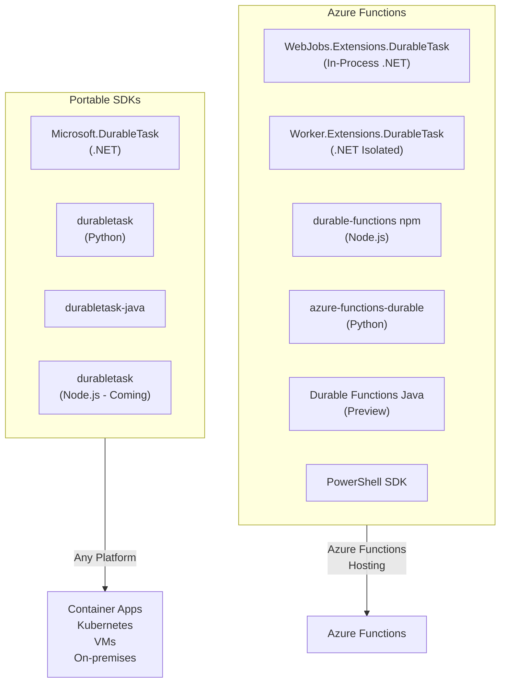

# SDK Overview
{: .no_toc }

## Table of contents
{: .no_toc .text-delta }

1. TOC
{:toc}

---

Understanding the different Durable Task SDK flavors and when to use each.
{: .fs-6 .fw-300 }

---

## SDK Categories

The Durable Task ecosystem offers two categories of SDKs:

1. **Azure Functions Extensions** - Designed specifically for Azure Functions hosting
2. **Portable Durable Task SDKs** - Platform-agnostic SDKs for any hosting environment



---

## Choosing the Right SDK

### Use Azure Functions Extensions When:

- You're deploying to Azure Functions
- You want automatic scaling with consumption plan
- You need minimal infrastructure management
- You prefer the Azure Functions programming model

### Use Portable SDKs When:

- You're deploying to Container Apps, Kubernetes, or VMs
- You need complete control over hosting and scaling
- You want to run on-premises or in non-Azure clouds
- You're building microservices with custom hosting requirements

---

## SDK Matrix

| Language | Azure Functions SDK | Portable SDK | Status |
|----------|---------------------|--------------|--------|
| **.NET (In-Process)** | `WebJobs.Extensions.DurableTask` | N/A | GA |
| **.NET (Isolated)** | `Worker.Extensions.DurableTask` | `Microsoft.DurableTask` | GA |
| **Python** | `azure-functions-durable` | `durabletask` | GA |
| **Java** | `durabletask-azure-functions` | `durabletask-client` | Preview |
| **Node.js** | `durable-functions` | Coming Soon | GA / Preview |
| **PowerShell** | `AzureFunctions.PowerShell.Durable.SDK` | N/A | GA |

---

## .NET SDKs

### Overview

.NET has three SDK options depending on your hosting and programming model:

| SDK | Hosting | Description |
|-----|---------|-------------|
| **Microsoft.DurableTask** | Portable | Modern, platform-agnostic SDK |
| **Worker.Extensions.DurableTask** | Azure Functions (Isolated) | .NET isolated worker for Azure Functions |
| **WebJobs.Extensions.DurableTask** | Azure Functions (In-Process) | Legacy in-process model |

### Portable SDK (Microsoft.DurableTask)

The portable SDK is recommended for new applications not hosted on Azure Functions.

```bash
dotnet add package Microsoft.DurableTask.Worker.AzureManaged
dotnet add package Microsoft.DurableTask.Client.AzureManaged
```

**Key Features:**
- Works with any .NET hosting (ASP.NET Core, Console, Worker Services)
- Type-safe orchestration and activity definitions
- Source generators for compile-time validation
- Native integration with dependency injection

### .NET Isolated SDK

For Azure Functions using the isolated worker model (.NET 6+):

```bash
dotnet add package Microsoft.Azure.Functions.Worker.Extensions.DurableTask
```

**When to Use:**
- Running Azure Functions on .NET 6, 7, or 8
- Need process isolation from the Functions host
- Want to use the latest .NET features

### In-Process SDK (Legacy)

For Azure Functions using the in-process model:

```bash
dotnet add package Microsoft.Azure.WebJobs.Extensions.DurableTask
```

> **Note:** The in-process model is being deprecated. Consider migrating to isolated worker or portable SDK.

---

## Python SDKs

### Overview

Python has two SDK options:

| SDK | Hosting | Description |
|-----|---------|-------------|
| **durabletask** | Portable | Platform-agnostic SDK |
| **azure-functions-durable** | Azure Functions | Azure Functions integration |

### Portable SDK (durabletask)

For applications running outside Azure Functions:

```bash
pip install durabletask-azuremanaged
```

**Key Features:**
- Works with any Python hosting
- Generator-based orchestrations
- Async/await support

### Azure Functions SDK

For Azure Functions hosting:

```bash
pip install azure-functions-durable
```

**Key Features:**
- Decorators for orchestration, activity, and entity triggers
- Integration with Azure Functions Python v2 model
- Seamless storage provider configuration

---

## Node.js SDKs

### Overview

| SDK | Hosting | Description |
|-----|---------|-------------|
| **durable-functions** | Azure Functions | Full-featured Azure Functions SDK |
| **durabletask** | Portable | Coming soon |

### Azure Functions SDK

For Azure Functions (v3 and v4 programming models):

```bash
npm install durable-functions
```

**Programming Model Versions:**
- `durable-functions@2.x` - v3 programming model
- `durable-functions@3.x` - v4 programming model (recommended)

**Key Features:**
- Generator-based orchestrations
- JavaScript and TypeScript support
- Entity functions support

---

## Java SDKs

### Overview

| SDK | Hosting | Description |
|-----|---------|-------------|
| **durabletask-azure-functions** | Azure Functions | Azure Functions Java integration |
| **durabletask-client** | Portable | Platform-agnostic SDK |

### Portable SDK

```xml
<dependency>
    <groupId>com.microsoft</groupId>
    <artifactId>durabletask-client</artifactId>
    <version>1.5.1</version>
</dependency>
<dependency>
    <groupId>com.microsoft</groupId>
    <artifactId>durabletask-azure-managed</artifactId>
    <version>1.5.1</version>
</dependency>
```

> **Note:** Java SDK is currently in Preview.

---

## PowerShell SDK

### Overview

PowerShell support is available exclusively for Azure Functions:

| SDK | Hosting | Description |
|-----|---------|-------------|
| **AzureFunctions.PowerShell.Durable.SDK** | Azure Functions | Standalone PowerShell SDK |

### Installation

```powershell
# In requirements.psd1
@{
    'AzureFunctions.PowerShell.Durable.SDK' = '2.*'
}
```

```powershell
# In profile.ps1
Import-Module AzureFunctions.PowerShell.Durable.SDK -ErrorAction Stop
```

**Prerequisites:**
- PowerShell 7.4+
- `ExternalDurablePowerShellSDK` app setting set to `"true"`

---

## Feature Comparison

| Feature | .NET Portable | .NET AF | Python | Node.js | Java | PowerShell |
|---------|---------------|---------|--------|---------|------|------------|
| **Orchestrations** | ✅ | ✅ | ✅ | ✅ | ✅ | ✅ |
| **Activities** | ✅ | ✅ | ✅ | ✅ | ✅ | ✅ |
| **Sub-orchestrations** | ✅ | ✅ | ✅ | ✅ | ✅ | ✅ |
| **Durable Timers** | ✅ | ✅ | ✅ | ✅ | ✅ | ✅ |
| **External Events** | ✅ | ✅ | ✅ | ✅ | ✅ | ✅ |
| **Durable Entities** | ✅ | ✅ | ✅ | ✅ | ❌ | ❌ |
| **Retry Policies** | ✅ | ✅ | ✅ | ✅ | ✅ | ✅ |
| **Continue-as-new** | ✅ | ✅ | ✅ | ✅ | ✅ | ✅ |
| **HTTP Call** | ✅ | ✅ | ✅ | ✅ | ❌ | ❌ |
| **Suspend/Resume** | ✅ | ✅ | ✅ | ✅ | ✅ | ✅ |

---

## Migration Paths

### .NET In-Process → Isolated Worker

1. Update target framework to .NET 6+
2. Replace `Microsoft.Azure.WebJobs.Extensions.DurableTask` with `Microsoft.Azure.Functions.Worker.Extensions.DurableTask`
3. Update function attributes from `[FunctionName]` to `[Function]`
4. Replace `IDurableOrchestrationContext` with `TaskOrchestrationContext`

### .NET In-Process → Portable SDK

1. Remove Azure Functions dependencies
2. Add `Microsoft.DurableTask.Worker.AzureManaged` and `Microsoft.DurableTask.Client.AzureManaged`
3. Convert to worker/client pattern
4. Update hosting code

### Node.js v3 → v4 Programming Model

1. Update `durable-functions` to v3.x
2. Replace `function.json` with code-based registration
3. Update orchestrator syntax from `df.orchestrator()` to `df.app.orchestration()`

---

## Next Steps

- [.NET SDK Reference →](./dotnet/index.md)
- [Python SDK Reference →](./python/index.md)
- [Node.js SDK Reference →](./nodejs/index.md)
- [Java SDK Reference →](./java/index.md)
- [PowerShell SDK Reference →](./powershell/index.md)
