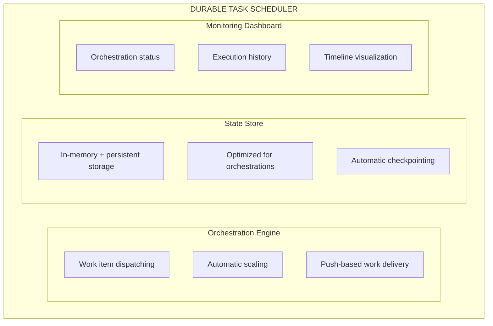
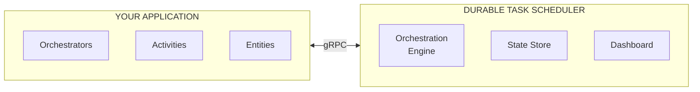
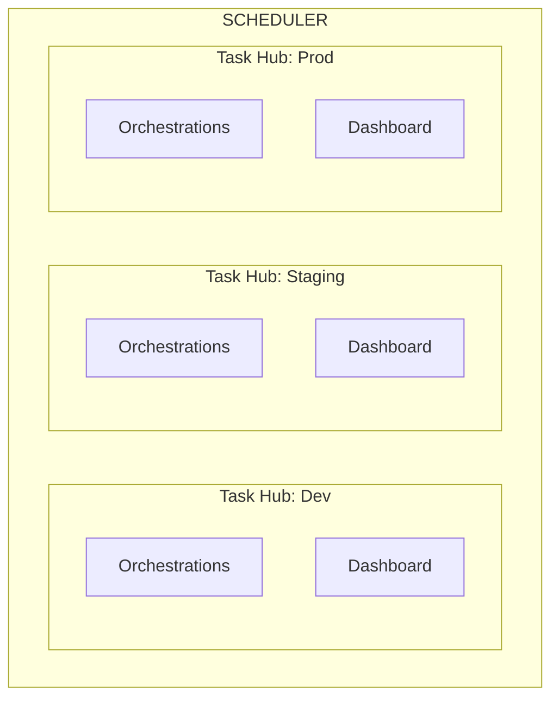
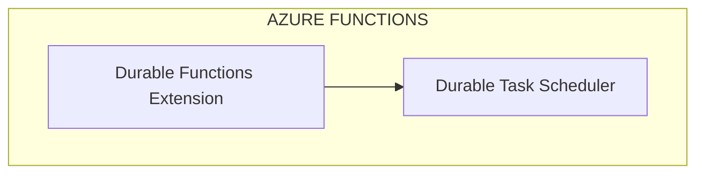
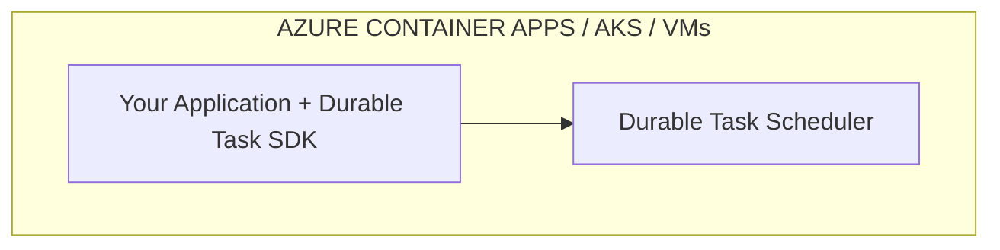

# Durable Task Scheduler
{: .no_toc }

## Table of contents
{: .no_toc .text-delta }

1. TOC
{:toc}

---

The **Azure Functions Durable Task Scheduler** is a fully managed, high-performance backend for running durable orchestrations. It's designed specifically for the Durable Task Framework and provides the best experience for production workloads.

---

## What is the Durable Task Scheduler?

The Durable Task Scheduler is a managed Azure service that serves as the orchestration engine and state store for:

- **Azure Durable Functions** — As an alternative to Azure Storage or MSSQL backends
- **Durable Task SDKs** — For applications running on ACA, AKS, or other compute platforms



---

## Key Benefits

### 🚀 Fully Managed

No storage accounts to configure, no infrastructure to manage. The Durable Task Scheduler handles everything:

- Automatic provisioning
- Built-in scaling
- Managed compute and storage
- Zero maintenance

### ⚡ High Performance

Purpose-built for orchestration workloads:

- Push-based work item delivery (no polling)
- Optimized state storage
- Reduced latency
- Highest throughput of all backends

### 📊 Built-in Observability

Out-of-the-box monitoring dashboard:

- View orchestration status
- Inspect execution history
- Analyze performance metrics
- Debug failures visually

### 🔐 Secure by Default

Enterprise-grade security:

- Managed identity authentication
- Role-based access control (RBAC)
- No connection strings with secrets
- Secure gRPC connections

---

## Architecture

### Operational Separation

The Durable Task Scheduler runs separately from your application, providing:



**Benefits of separation:**
- **Reduced resource consumption** — Your app doesn't manage partitions
- **Fault isolation** — Scheduler issues don't crash your app
- **Independent scaling** — Scheduler scales separately from your app
- **Shared infrastructure** — Multiple apps can use one scheduler

### Connectivity

Apps connect to the scheduler via:

- **Protocol**: gRPC over TLS
- **Authentication**: Managed identity (user-assigned or system-assigned)
- **Endpoint format**: `{scheduler-name}.{region}.durabletask.io`

---

## Task Hubs

A **task hub** is a logical container for orchestrations within a scheduler:



### Task Hub Use Cases

- **Environment isolation** — Separate dev, staging, and prod
- **Team isolation** — Different teams get their own task hubs
- **Application isolation** — Group related orchestrations together

### Creating Task Hubs

Each task hub has its own:
- Orchestration instances
- Monitoring dashboard
- Access control settings

---

## Comparison with Other Backends

| Feature | Durable Task Scheduler | Azure Storage | MSSQL |
|---------|------------------------|---------------|-------|
| **Management** | Fully managed | Self-managed | Self-managed |
| **Performance** | Highest | Good | Good |
| **Monitoring** | Built-in dashboard | External tools | External tools |
| **Setup** | Simple | Moderate | Complex |
| **Cost model** | Per-operation | Storage costs | SQL costs |
| **Authentication** | Managed identity | Connection string | Connection string |

---

## Supported Scenarios

### With Durable Functions



### With Durable Task SDKs



---

## Emulator for Local Development

The Durable Task Scheduler includes a local emulator for development:

```bash
# Pull the emulator image
docker pull mcr.microsoft.com/dts/dts-emulator:latest

# Run the emulator
docker run -itP mcr.microsoft.com/dts/dts-emulator:latest
```

### Multiple Task Hubs

```bash
# Run with multiple task hubs
docker run -itP \
  -e DTS_TASK_HUB_NAMES=dev,staging,prod \
  mcr.microsoft.com/dts/dts-emulator:latest
```

The emulator provides:
- Full compatibility with the cloud service
- Local dashboard at `http://localhost:8082`
- No authentication required

---

## Getting Started

### Prerequisites

- Azure subscription
- Azure CLI installed
- Docker (for local development)

### Quick Start

1. **Create a Scheduler**

   ```bash
   az durabletask scheduler create \
     --resource-group myResourceGroup \
     --name myScheduler \
     --location westus2
   ```

2. **Create a Task Hub**

   ```bash
   az durabletask taskhub create \
     --resource-group myResourceGroup \
     --scheduler-name myScheduler \
     --name myTaskHub
   ```

3. **Configure Access**

   See [Identity Configuration](./identity.md) for setting up managed identity.

---

## Pricing

The Durable Task Scheduler offers:

| SKU | Description | Best For |
|-----|-------------|----------|
| **Consumption** | Pay-per-operation | Development, low-volume |
| **Dedicated** | Reserved capacity | Production, high-volume |

---

## Limitations

Current limitations (as of November 2025):

- **Regions**: Available in select Azure regions
- **Entity support**: Full support with Durable Functions, limited with SDKs
- **Java SDK**: Currently in preview

---

## Related Documentation

- [Setup Guide →](./setup.md)
- [Dashboard Guide →](./dashboard.md)
- [Identity Configuration →](./identity.md)
- [Auto-Purge Retention Policies →](./auto-purge.md)
- [Pricing & SKUs →](./pricing.md)
- [Troubleshooting →](./troubleshooting.md)
- [Durable Functions Integration →](../durable-functions/overview.md)
- [Durable Task SDKs →](../sdks/overview.md)

---

## Next Steps

- [Set up your first Scheduler →](./setup.md)
- [Configure managed identity →](./identity.md)
- [Explore the monitoring dashboard →](./dashboard.md)
- [Configure auto-purge policies →](./auto-purge.md)
- [Understand pricing options →](./pricing.md)
