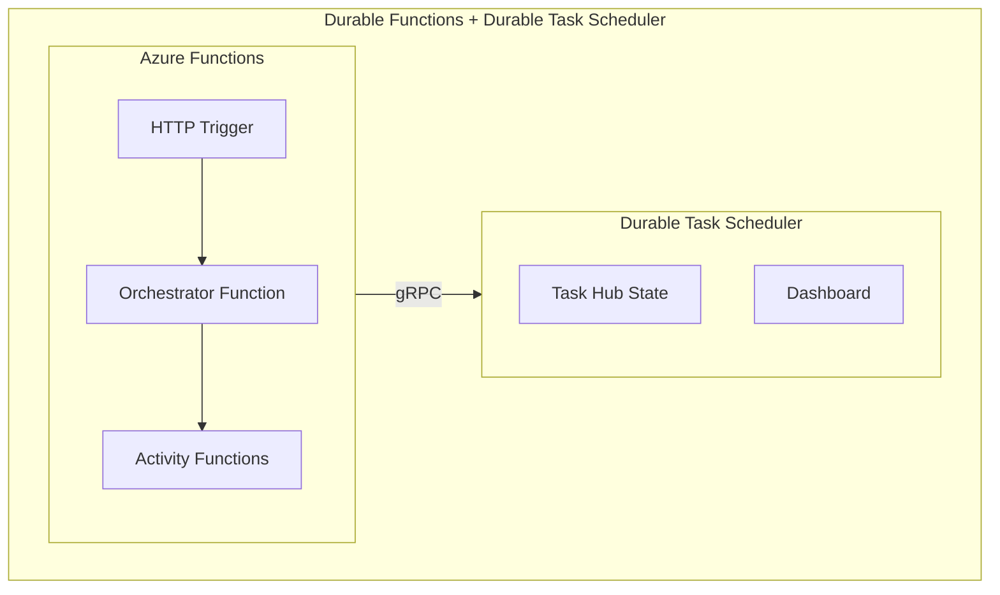

# Durable Functions Deployment Guide
{: .no_toc }

## Table of contents
{: .no_toc .text-delta }

1. TOC
{:toc}

---

Configure Azure Durable Functions to use the Durable Task Scheduler as its backend and deploy to Azure.

---

## Overview

Durable Functions can use the Durable Task Scheduler as a storage backend instead of the default Azure Storage. This provides a fully managed experience with built-in dashboard, better performance, and simplified operations.



---

## Prerequisites

1. Azure subscription
2. Durable Task Scheduler resource
3. Azure Functions Core Tools (v4+)
4. .NET 8 SDK or Node.js 18+/Python 3.10+

---

## Step 1: Create Durable Task Scheduler

### Azure CLI

```bash
# Create resource group
az group create --name rg-durable --location centralus

# Create Durable Task Scheduler
az durabletask scheduler create \
  --resource-group rg-durable \
  --name my-scheduler \
  --location centralus \
  --sku dedicated

# Create Task Hub
az durabletask taskhub create \
  --resource-group rg-durable \
  --scheduler-name my-scheduler \
  --name default
```

### Azure Portal

1. Search for "Durable Task Scheduler" in the portal
2. Click "Create"
3. Configure resource group, name, and region
4. Create a Task Hub after the scheduler is deployed

---

## Step 2: Create Functions Project

### .NET (Isolated Worker)

```bash
# Create project
func init MyDurableFunctions --worker-runtime dotnet-isolated --target-framework net8.0

cd MyDurableFunctions

# Add Durable Task Scheduler packages
dotnet add package Microsoft.Azure.Functions.Worker.Extensions.DurableTask
dotnet add package Microsoft.Azure.Functions.Worker.Extensions.DurableTask.AzureManaged
```

### JavaScript/TypeScript

```bash
# Create project
func init MyDurableFunctions --worker-runtime node --language typescript

cd MyDurableFunctions

# Add packages
npm install durable-functions @azure/functions
```

### Python

```bash
# Create project
func init MyDurableFunctions --worker-runtime python

cd MyDurableFunctions

# Add packages
pip install azure-functions-durable
```

---

## Step 3: Configure Connection

### host.json

```json
{
  "version": "2.0",
  "extensions": {
    "durableTask": {
      "storageProvider": {
        "type": "azureManaged",
        "connectionStringName": "DurableTaskSchedulerConnection"
      }
    }
  }
}
```

### local.settings.json

```json
{
  "IsEncrypted": false,
  "Values": {
    "AzureWebJobsStorage": "UseDevelopmentStorage=true",
    "FUNCTIONS_WORKER_RUNTIME": "dotnet-isolated",
    "DurableTaskSchedulerConnection__endpoint": "https://my-scheduler.centralus.durabletask.io",
    "DurableTaskSchedulerConnection__taskHub": "default",
    "DurableTaskSchedulerConnection__authentication": "ManagedIdentity"
  }
}
```

---

## Step 4: Write Functions

### C# (.NET Isolated)

```csharp
using Microsoft.Azure.Functions.Worker;
using Microsoft.Azure.Functions.Worker.Http;
using Microsoft.DurableTask;
using Microsoft.DurableTask.Client;

public class OrderFunctions
{
    [Function("StartOrder")]
    public async Task<HttpResponseData> StartOrder(
        [HttpTrigger(AuthorizationLevel.Anonymous, "post")] HttpRequestData req,
        [DurableClient] DurableTaskClient client)
    {
        var order = await req.ReadFromJsonAsync<Order>();
        
        var instanceId = await client.ScheduleNewOrchestrationInstanceAsync(
            nameof(ProcessOrder),
            order
        );
        
        var response = req.CreateResponse(HttpStatusCode.Accepted);
        await response.WriteAsJsonAsync(new { instanceId });
        return response;
    }
    
    [Function(nameof(ProcessOrder))]
    public async Task<OrderResult> ProcessOrder(
        [OrchestrationTrigger] TaskOrchestrationContext context)
    {
        var order = context.GetInput<Order>();
        
        // Validate
        var isValid = await context.CallActivityAsync<bool>(
            nameof(ValidateOrder), 
            order
        );
        
        if (!isValid)
        {
            return new OrderResult { Success = false };
        }
        
        // Process
        await context.CallActivityAsync(nameof(ProcessPayment), order);
        await context.CallActivityAsync(nameof(ShipOrder), order);
        
        return new OrderResult { Success = true, OrderId = order.Id };
    }
    
    [Function(nameof(ValidateOrder))]
    public bool ValidateOrder([ActivityTrigger] Order order)
    {
        return order.Items?.Any() == true && order.Total > 0;
    }
    
    [Function(nameof(ProcessPayment))]
    public void ProcessPayment([ActivityTrigger] Order order, ILogger log)
    {
        log.LogInformation("Processing payment for order {OrderId}", order.Id);
    }
    
    [Function(nameof(ShipOrder))]
    public void ShipOrder([ActivityTrigger] Order order, ILogger log)
    {
        log.LogInformation("Shipping order {OrderId}", order.Id);
    }
}
```

### Python


```python
import azure.functions as func
import azure.durable_functions as df

app = func.FunctionApp()

@app.route(route="start", methods=["POST"])
@app.durable_client_input(client_name="client")
async def start_order(req: func.HttpRequest, client: df.DurableOrchestrationClient):
    order = req.get_json()
    instance_id = await client.start_new("process_order", client_input=order)
    return func.HttpResponse(f'{{"instanceId": "{instance_id}"}}', status_code=202)

@app.orchestration_trigger(context_name="context")
def process_order(context: df.DurableOrchestrationContext):
    order = context.get_input()
    
    is_valid = yield context.call_activity("validate_order", order)
    
    if not is_valid:
        return {"success": False}
    
    yield context.call_activity("process_payment", order)
    yield context.call_activity("ship_order", order)
    
    return {"success": True, "orderId": order["id"]}

@app.activity_trigger(input_name="order")
def validate_order(order: dict) -> bool:
    return len(order.get("items", [])) > 0 and order.get("total", 0) > 0

@app.activity_trigger(input_name="order")
def process_payment(order: dict):
    pass

@app.activity_trigger(input_name="order")
def ship_order(order: dict):
    pass
```


---

## Step 5: Configure Managed Identity

### Azure Portal

1. Go to your Function App
2. Navigate to Identity → System assigned
3. Enable system-assigned managed identity
4. Go to Durable Task Scheduler → Access Control (IAM)
5. Add role assignment: "Durable Task Data Contributor"
6. Assign to your Function App's managed identity

### Azure CLI

```bash
# Get Function App identity
FUNCTION_PRINCIPAL_ID=$(az functionapp identity show \
  --name my-function-app \
  --resource-group rg-durable \
  --query principalId -o tsv)

# Get Scheduler resource ID
SCHEDULER_ID=$(az durabletask scheduler show \
  --name my-scheduler \
  --resource-group rg-durable \
  --query id -o tsv)

# Assign role
az role assignment create \
  --role "Durable Task Data Contributor" \
  --assignee $FUNCTION_PRINCIPAL_ID \
  --scope $SCHEDULER_ID
```

---

## Step 6: Deploy

### Azure CLI

```bash
# Deploy to Azure
func azure functionapp publish my-function-app

# Or using Azure CLI
az functionapp deployment source config-zip \
  --name my-function-app \
  --resource-group rg-durable \
  --src app.zip
```

### GitHub Actions


```yaml
name: Deploy Functions

on:
  push:
    branches: [main]

jobs:
  deploy:
    runs-on: ubuntu-latest
    steps:
      - uses: actions/checkout@v4
      
      - name: Setup .NET
        uses: actions/setup-dotnet@v4
        with:
          dotnet-version: '8.0.x'
      
      - name: Build
        run: dotnet build --configuration Release
      
      - name: Publish
        run: dotnet publish -c Release -o ./publish
      
      - name: Deploy to Azure Functions
        uses: Azure/functions-action@v1
        with:
          app-name: my-function-app
          package: ./publish
          publish-profile: ${{ secrets.AZURE_FUNCTIONAPP_PUBLISH_PROFILE }}
```


---

## App Settings Reference

| Setting | Description | Example |
|---------|-------------|---------|
| `DurableTaskSchedulerConnection__endpoint` | Scheduler endpoint | `https://my-scheduler.centralus.durabletask.io` |
| `DurableTaskSchedulerConnection__taskHub` | Task hub name | `default` |
| `DurableTaskSchedulerConnection__authentication` | Auth type | `ManagedIdentity` |
| `DurableTaskSchedulerConnection__clientId` | User-assigned MI | `guid` (optional) |

---

## Troubleshooting

| Issue | Possible Cause | Solution |
|-------|---------------|----------|
| `Unable to resolve storage provider` | Missing NuGet package | Add `Microsoft.Azure.Functions.Worker.Extensions.DurableTask.AzureManaged` package |
| `401 Unauthorized` | Managed identity not configured | Enable system-assigned identity; assign "Durable Task Data Contributor" role |
| Orchestration not starting | Wrong endpoint format | Ensure endpoint uses `https://` and correct region (e.g., `centralus.durabletask.io`) |
| `TaskHub not found` | Task hub doesn't exist | Create task hub via CLI: `az durabletask taskhub create` |
| Local debugging fails | Missing connection settings | Verify `local.settings.json` has all `DurableTaskSchedulerConnection__*` values |
| Python import errors | Missing package | Run `pip install azure-functions-durable` |

**Debugging Commands:**

```bash
# Verify scheduler exists and get endpoint
az durabletask scheduler show \
  --name my-scheduler \
  --resource-group rg-durable \
  --query "{endpoint: properties.endpoint, status: provisioningState}"

# List task hubs
az durabletask taskhub list \
  --resource-group rg-durable \
  --scheduler-name my-scheduler

# Check Function App identity
az functionapp identity show \
  --name my-function-app \
  --resource-group rg-durable

# Verify role assignments on scheduler
az role assignment list \
  --scope $(az durabletask scheduler show -n my-scheduler -g rg-durable --query id -o tsv) \
  --output table

# View Function App logs
az functionapp log tail \
  --name my-function-app \
  --resource-group rg-durable
```

**Common Configuration Mistakes:**

1. **host.json type value**: Use `"type": "azureManaged"` (not `"durabletaskscheduler"` for Durable Functions)
2. **Connection string name**: The `connectionStringName` must match your app settings prefix (e.g., `DurableTaskSchedulerConnection`)
3. **Double underscores**: Use `__` (double underscore) in app setting names, not `:` (colon)
4. **Missing authentication setting**: Always specify `DurableTaskSchedulerConnection__authentication` (typically `ManagedIdentity`)
5. **Task hub case sensitivity**: Task hub names are case-sensitive; ensure exact match

---

## Next Steps

- [View the Dashboard →](../../durable-task-scheduler/dashboard.md)
- [Configure Identity →](../../durable-task-scheduler/identity.md)
- [Configure Scaling →](./scaling.md)
- [Explore Patterns →](../../patterns/index.md)
