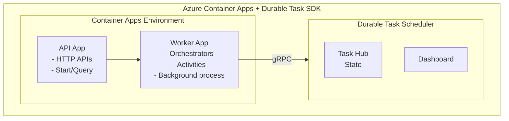
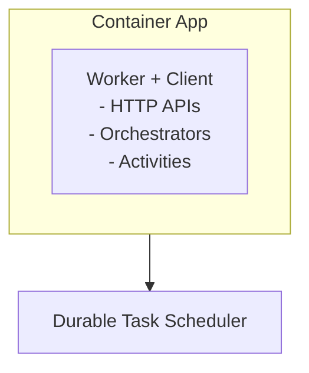
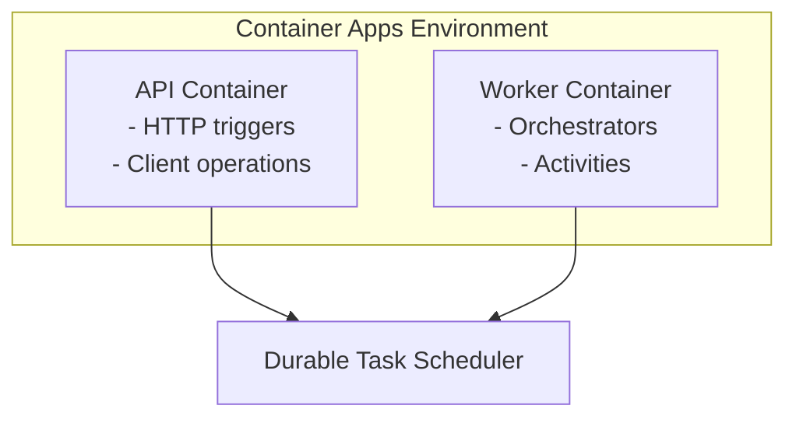

# Azure Container Apps
{: .no_toc }

## Table of contents
{: .no_toc .text-delta }

1. TOC
{:toc}

---

Deploy durable orchestrations to Azure Container Apps using the Durable Task SDK.
{: .fs-6 .fw-300 }

[Deployment Guide →](./deployment.md){: .btn .btn-primary .fs-5 .mb-4 .mb-md-0 .mr-2 }
[Configure Scaling →](./scaling.md){: .btn .fs-5 .mb-4 .mb-md-0 }

---

## Overview

Azure Container Apps provides a fully managed serverless container platform that's ideal for running Durable Task SDK workers. It offers automatic scaling, built-in HTTPS, and simplified deployment without needing to manage Kubernetes directly.



---

## Key Benefits

| Benefit | Description |
|---------|-------------|
| **Serverless Containers** | Run containers without managing infrastructure |
| **Built-in Autoscaling** | Scale based on HTTP traffic, events, or custom metrics |
| **KEDA Support** | Native KEDA integration for event-driven scaling |
| **Simplified Networking** | Built-in VNet integration and ingress |
| **Cost Efficient** | Pay only for resources consumed |
| **Microservices Ready** | Service discovery and Dapr integration |

---

## When to Use Container Apps

### ✅ Great For

- **Containerized microservices** — Running multiple services in containers
- **Event-driven workloads** — Auto-scale based on queue depth or events
- **Simplified Kubernetes** — Kubernetes-like features without complexity
- **Background workers** — Long-running background processing
- **API + Worker patterns** — Separate API and worker containers

### ⚠️ Consider Alternatives

- **Scale to zero with pay-per-execution** → [Azure Functions](../azure-functions/)
- **Full Kubernetes control** → [Azure Kubernetes Service](../kubernetes/)
- **Legacy VM-based workloads** → Virtual Machines with Durable Task SDK

---

## Architecture Patterns

### Single Container (Worker + Client)

For simpler applications where the worker and client run in the same container:



### Separate Containers (Recommended)

For production workloads, separate API and worker containers:



---

## Available SDKs

Container Apps work with the Durable Task SDKs in any language:

| SDK | Package | Status |
|-----|---------|--------|
| **.NET** | `Microsoft.DurableTask.Worker.AzureManaged` | ✅ GA |
| **Python** | `durabletask-azuremanaged` | ✅ GA |
| **Java** | `com.microsoft.durabletask` | ⚠️ Preview |

---

## Quick Start

### Prerequisites

- Azure subscription
- Azure CLI with containerapp extension
- Docker (for building images)
- Durable Task Scheduler resource

### 1. Create Infrastructure

```bash
# Variables
RESOURCE_GROUP="rg-durable-aca"
LOCATION="centralus"
SCHEDULER_NAME="my-scheduler"
ENVIRONMENT_NAME="durable-env"

# Create resource group
az group create --name $RESOURCE_GROUP --location $LOCATION

# Create Durable Task Scheduler
az durabletask scheduler create \
  --resource-group $RESOURCE_GROUP \
  --name $SCHEDULER_NAME \
  --location $LOCATION \
  --sku dedicated

# Create Container Apps Environment
az containerapp env create \
  --resource-group $RESOURCE_GROUP \
  --name $ENVIRONMENT_NAME \
  --location $LOCATION
```

### 2. Deploy Worker Container

```bash
az containerapp create \
  --resource-group $RESOURCE_GROUP \
  --name durable-worker \
  --environment $ENVIRONMENT_NAME \
  --image myregistry.azurecr.io/durable-worker:latest \
  --min-replicas 1 \
  --max-replicas 10 \
  --env-vars \
    "DTS_ENDPOINT=https://$SCHEDULER_NAME.$LOCATION.durabletask.io" \
    "TASKHUB_NAME=default"
```

---

## Comparison with Other Hosting Options

| Feature | Container Apps | Azure Functions | AKS |
|---------|----------------|-----------------|-----|
| **Container Support** | ✅ Native | ⚠️ Limited | ✅ Full |
| **Scale to Zero** | ✅ Yes | ✅ Yes | ⚠️ With KEDA |
| **Complexity** | Medium | Low | High |
| **Networking** | Built-in VNet | VNet integration | Full control |
| **Cost Model** | Per vCPU-second | Per execution | Node-based |
| **Scaling** | KEDA/Rules | Automatic | HPA/KEDA |

---

## In This Section

| Guide | Description |
|:------|:------------|
| [Deployment Guide](deployment.md) | Complete deployment walkthrough |
| [Scaling](scaling.md) | Configure autoscaling with KEDA |

---

## Next Steps

- [Deploy to Container Apps →](./deployment.md)
- [Configure Scaling →](./scaling.md)
- [Explore Developer Guide →](../../developer-guide/)
