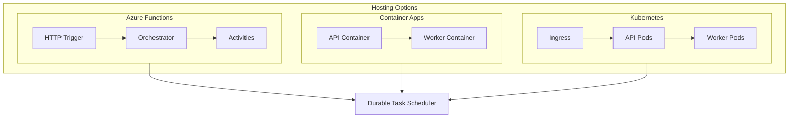

# Hosting Options
{: .no_toc }

Choose the right compute platform for your durable orchestrations.
{: .fs-6 .fw-300 }

---

## Overview

Durable orchestrations can run on multiple Azure compute platforms. Each option offers different tradeoffs between simplicity, control, and cost.

| Platform | Best For | Framework/SDK |
|----------|----------|---------------|
| **Azure Functions** | Serverless, event-driven workloads | Durable Functions |
| **Azure Container Apps** | Containerized microservices | Durable Task SDK |
| **Azure Kubernetes Service** | Full orchestration control | Durable Task SDK |

---

## Quick Comparison

```
┌──────────────────────────────────────────────────────────────────┐
│                    HOSTING OPTIONS COMPARISON                     │
├──────────────────────────────────────────────────────────────────┤
│                                                                   │
│  AZURE FUNCTIONS (Durable Functions)                             │
│  ┌─────────────────────────────────────────────────────────────┐ │
│  │  • Serverless, pay-per-execution                            │ │
│  │  • Scale to zero                                            │ │
│  │  • Built-in triggers and bindings                          │ │
│  │  • Multi-language support (C#, JS, Python, Java, PS)       │ │
│  │  • Fastest time to production                               │ │
│  └─────────────────────────────────────────────────────────────┘ │
│                                                                   │
│  AZURE CONTAINER APPS (Durable Task SDK)                         │
│  ┌─────────────────────────────────────────────────────────────┐ │
│  │  • Container-based workloads                                │ │
│  │  • KEDA-based autoscaling                                   │ │
│  │  • Simplified Kubernetes experience                         │ │
│  │  • Good for microservices architectures                     │ │
│  └─────────────────────────────────────────────────────────────┘ │
│                                                                   │
│  AZURE KUBERNETES SERVICE (Durable Task SDK)                     │
│  ┌─────────────────────────────────────────────────────────────┐ │
│  │  • Full Kubernetes control                                  │ │
│  │  • Custom networking and scaling                            │ │
│  │  • Existing K8s investment                                  │ │
│  │  • Maximum flexibility                                      │ │
│  └─────────────────────────────────────────────────────────────┘ │
│                                                                   │
└──────────────────────────────────────────────────────────────────┘
```

---

## Decision Guide

### Choose Azure Functions When:

- ✅ You want serverless, pay-per-execution pricing
- ✅ You need scale-to-zero capability
- ✅ You want to leverage Azure Functions triggers and bindings
- ✅ You're building event-driven applications
- ✅ You prefer a familiar Azure Functions programming model
- ✅ You need multi-language support (C#, JavaScript, Python, Java, PowerShell)

### Choose Azure Container Apps When:

- ✅ You have containerized workloads
- ✅ You want a simplified Kubernetes-like experience
- ✅ You need microservices with service discovery
- ✅ You want KEDA-based autoscaling
- ✅ You don't need full Kubernetes control

### Choose Azure Kubernetes Service When:

- ✅ You need full control over infrastructure
- ✅ You have existing Kubernetes expertise
- ✅ You need custom networking configurations
- ✅ You're integrating with existing K8s workloads
- ✅ You need advanced scaling strategies

---

## Feature Comparison

| Feature | Azure Functions | Container Apps | AKS |
|---------|-----------------|----------------|-----|
| **Pricing Model** | Pay-per-execution | Per vCPU-second | Node-based |
| **Scale to Zero** | ✅ Yes | ✅ Yes | ⚠️ With KEDA |
| **Min Instances** | 0 | 0 | 1+ pods |
| **Max Scale** | 200+ instances | 300 replicas | Unlimited |
| **Startup Time** | Cold start possible | Faster with min replicas | Depends on config |
| **Networking** | VNet integration | Built-in VNet | Full control |
| **Language Support** | C#, JS, Python, Java, PS | Any containerized | Any containerized |
| **Local Development** | Functions Core Tools | Docker | Docker/minikube |
| **Complexity** | Low | Medium | High |

---

## Architecture Overview



---

## In This Section

| Guide | Description |
|:------|:------------|
| [Azure Functions (Durable Functions)](azure-functions/) | Serverless orchestrations with Azure Functions |
| [Azure Container Apps](container-apps/) | Containerized workers with managed Kubernetes |
| [Azure Kubernetes Service](kubernetes/) | Full Kubernetes deployment |

---

## Next Steps

Choose your hosting platform:

- [Azure Functions (Durable Functions) →](azure-functions/)
- [Azure Container Apps →](container-apps/)
- [Azure Kubernetes Service →](kubernetes/)
