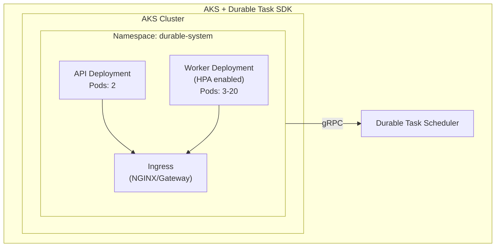
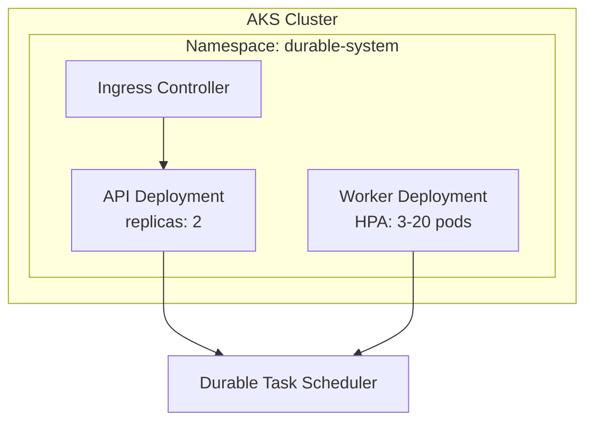
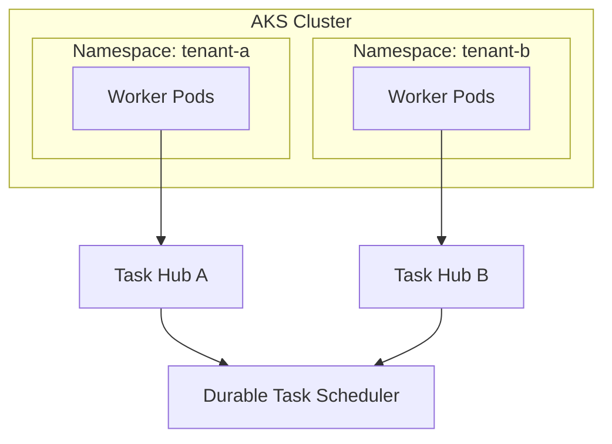

# Azure Kubernetes Service
{: .no_toc }

## Table of contents
{: .no_toc .text-delta }

1. TOC
{:toc}

---

Deploy durable orchestrations to AKS for full control over scaling, networking, and operations.
{: .fs-6 .fw-300 }

[Deployment Guide →](./deployment.md){: .btn .btn-primary .fs-5 .mb-4 .mb-md-0 .mr-2 }
[Configure Scaling →](./scaling.md){: .btn .fs-5 .mb-4 .mb-md-0 }

---

## Overview

Azure Kubernetes Service (AKS) provides the most flexibility for deploying Durable Task SDK workers. Use AKS when you need fine-grained control over infrastructure, custom scaling, or integration with existing Kubernetes workloads.



---

## Key Benefits

| Benefit | Description |
|---------|-------------|
| **Full Control** | Complete control over infrastructure, networking, and scaling |
| **Custom Networking** | Advanced networking configurations and policies |
| **HPA & KEDA** | Multiple scaling options including custom metrics |
| **Multi-tenant** | Run multiple task hubs in different namespaces |
| **Existing Investment** | Leverage existing Kubernetes expertise and tools |
| **Observability** | Integration with Prometheus, Grafana, and other K8s tools |

---

## When to Use AKS

### ✅ Great For

- **Existing Kubernetes workloads** — Integrate with existing clusters
- **Advanced networking** — Custom network policies and configurations
- **Multi-tenant scenarios** — Isolate workloads in namespaces
- **Custom scaling** — Complex HPA or KEDA configurations
- **Compliance requirements** — Full control over security configurations
- **GitOps workflows** — Flux, ArgoCD, and other GitOps tools

### ⚠️ Consider Alternatives

- **Simpler deployments** → [Azure Container Apps](../container-apps/)
- **Serverless with pay-per-execution** → [Azure Functions](../azure-functions/)
- **Quick prototyping** → Azure Functions with Durable Functions

---

## Architecture Patterns

### Standard Deployment

Separate API and worker deployments with HPA:



### Multi-Tenant Deployment

Multiple task hubs in isolated namespaces:



---

## Available SDKs

AKS works with the Durable Task SDKs in any language:

| SDK | Package | Status |
|-----|---------|--------|
| **.NET** | `Microsoft.DurableTask.Worker.AzureManaged` | ✅ GA |
| **Python** | `durabletask-azuremanaged` | ✅ GA |
| **Java** | `com.microsoft.durabletask` | ⚠️ Preview |

---

## Quick Start

### Prerequisites

- Azure subscription
- Azure CLI with aks-preview extension
- kubectl configured
- Docker

### 1. Create AKS Cluster

```bash
# Variables
RESOURCE_GROUP="rg-durable-aks"
LOCATION="centralus"
CLUSTER_NAME="durable-aks"
SCHEDULER_NAME="my-scheduler"

# Create resource group
az group create --name $RESOURCE_GROUP --location $LOCATION

# Create AKS cluster with workload identity
az aks create \
  --resource-group $RESOURCE_GROUP \
  --name $CLUSTER_NAME \
  --node-count 3 \
  --enable-oidc-issuer \
  --enable-workload-identity \
  --generate-ssh-keys

# Get credentials
az aks get-credentials \
  --resource-group $RESOURCE_GROUP \
  --name $CLUSTER_NAME
```

### 2. Deploy Worker

```bash
kubectl apply -f - <<EOF
apiVersion: apps/v1
kind: Deployment
metadata:
  name: durable-worker
  namespace: durable-system
spec:
  replicas: 3
  selector:
    matchLabels:
      app: durable-worker
  template:
    metadata:
      labels:
        app: durable-worker
    spec:
      containers:
      - name: worker
        image: myregistry.azurecr.io/durable-worker:latest
        env:
        - name: DTS_ENDPOINT
          value: "https://my-scheduler.centralus.durabletask.io"
        - name: TASKHUB_NAME
          value: "default"
EOF
```

---

## Comparison with Other Hosting Options

| Feature | AKS | Container Apps | Azure Functions |
|---------|-----|----------------|-----------------|
| **Control** | Full | Medium | Low |
| **Complexity** | High | Medium | Low |
| **Networking** | Full control | Built-in | VNet integration |
| **Scaling** | HPA/KEDA | KEDA/Rules | Automatic |
| **Cost Model** | Node-based | Per vCPU-second | Per execution |
| **Learning Curve** | Steep | Moderate | Gentle |

---

## In This Section

| Guide | Description |
|:------|:------------|
| [Deployment Guide](deployment.md) | Complete AKS deployment walkthrough |
| [Scaling](scaling.md) | Configure HPA and KEDA scaling |

---

## Next Steps

- [Deploy to AKS →](./deployment.md)
- [Configure Scaling →](./scaling.md)
- [Explore Developer Guide →](../../developer-guide/)
