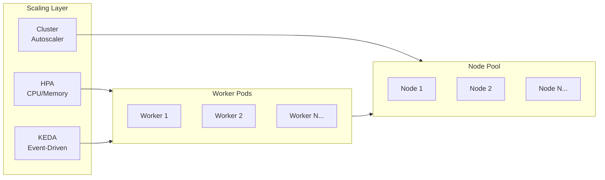

# Azure Kubernetes Service Scaling Guide
{: .no_toc }

## Table of contents
{: .no_toc .text-delta }

1. TOC
{:toc}

---

Configure horizontal scaling for Durable Task SDK workers on AKS.
{: .fs-6 .fw-300 }

---

## Scaling Overview

AKS provides multiple scaling options for Durable Task workers:

| Method | Best For | Response Time |
|--------|----------|---------------|
| **HPA** | CPU/memory-based scaling | ~15-30 seconds |
| **KEDA** | Event-driven scaling, including scale-to-zero | ~5-15 seconds |
| **Cluster Autoscaler** | Node pool scaling | ~2-5 minutes |
| **Manual** | Predictable workloads | Immediate |



---

## Horizontal Pod Autoscaler (HPA)

### Basic HPA Configuration

```yaml
apiVersion: autoscaling/v2
kind: HorizontalPodAutoscaler
metadata:
  name: durable-worker-hpa
  namespace: durable-system
spec:
  scaleTargetRef:
    apiVersion: apps/v1
    kind: Deployment
    name: durable-worker
  minReplicas: 3
  maxReplicas: 20
  metrics:
  - type: Resource
    resource:
      name: cpu
      target:
        type: Utilization
        averageUtilization: 70
  - type: Resource
    resource:
      name: memory
      target:
        type: Utilization
        averageUtilization: 80
  behavior:
    scaleDown:
      stabilizationWindowSeconds: 300
      policies:
      - type: Percent
        value: 10
        periodSeconds: 60
    scaleUp:
      stabilizationWindowSeconds: 0
      policies:
      - type: Percent
        value: 100
        periodSeconds: 15
      - type: Pods
        value: 4
        periodSeconds: 15
      selectPolicy: Max
```

### Apply HPA

```bash
kubectl apply -f hpa.yaml

# Verify HPA status
kubectl get hpa -n durable-system

# Watch scaling behavior
kubectl get hpa -n durable-system -w
```

---

## KEDA-Based Scaling

KEDA provides more granular event-driven scaling, ideal for Durable Task workloads.

### Install KEDA on AKS

```bash
# Add KEDA Helm repo
helm repo add kedacore https://kedacore.github.io/charts
helm repo update

# Install KEDA
helm install keda kedacore/keda \
  --namespace keda \
  --create-namespace

# Verify installation
kubectl get pods -n keda
```

### KEDA ScaledObject for Durable Tasks

While there's no native Durable Task scaler, you can use CPU-based scaling with KEDA's advanced features:

```yaml
apiVersion: keda.sh/v1alpha1
kind: ScaledObject
metadata:
  name: durable-worker-scaledobject
  namespace: durable-system
spec:
  scaleTargetRef:
    name: durable-worker
  pollingInterval: 15
  cooldownPeriod: 300
  minReplicaCount: 3
  maxReplicaCount: 50
  triggers:
  - type: cpu
    metricType: Utilization
    metadata:
      value: "70"
  - type: memory
    metricType: Utilization
    metadata:
      value: "80"
  advanced:
    restoreToOriginalReplicaCount: false
    horizontalPodAutoscalerConfig:
      behavior:
        scaleDown:
          stabilizationWindowSeconds: 300
          policies:
          - type: Percent
            value: 10
            periodSeconds: 60
        scaleUp:
          stabilizationWindowSeconds: 0
          policies:
          - type: Percent
            value: 100
            periodSeconds: 15
```

### Scale-to-Zero with KEDA

For non-critical workloads, configure scale-to-zero:

```yaml
apiVersion: keda.sh/v1alpha1
kind: ScaledObject
metadata:
  name: durable-worker-scale-to-zero
  namespace: durable-system
spec:
  scaleTargetRef:
    name: durable-worker
  pollingInterval: 30
  cooldownPeriod: 600
  minReplicaCount: 0
  maxReplicaCount: 20
  triggers:
  - type: cpu
    metricType: Utilization
    metadata:
      value: "50"
```

{: .warning }
> **Scale-to-Zero Considerations**: When scaling to zero, there will be a cold-start delay when new orchestrations are scheduled. This is suitable for batch workloads but not recommended for latency-sensitive applications.

---

## Cluster Autoscaler

### Enable Cluster Autoscaler

```bash
# Update AKS cluster with autoscaler
az aks update \
  --resource-group $RESOURCE_GROUP \
  --name $CLUSTER_NAME \
  --enable-cluster-autoscaler \
  --min-count 2 \
  --max-count 10

# For multi-node pool clusters
az aks nodepool update \
  --resource-group $RESOURCE_GROUP \
  --cluster-name $CLUSTER_NAME \
  --name workerpool \
  --enable-cluster-autoscaler \
  --min-count 1 \
  --max-count 20
```

### Configure Autoscaler Profile

```bash
az aks update \
  --resource-group $RESOURCE_GROUP \
  --name $CLUSTER_NAME \
  --cluster-autoscaler-profile \
    scale-down-delay-after-add=10m \
    scale-down-unneeded-time=10m \
    scale-down-utilization-threshold=0.5 \
    max-graceful-termination-sec=600
```

---

## Dedicated Node Pools

Create dedicated node pools for Durable Task workers:

```bash
# Create dedicated node pool
az aks nodepool add \
  --resource-group $RESOURCE_GROUP \
  --cluster-name $CLUSTER_NAME \
  --name durableworkers \
  --node-count 3 \
  --node-vm-size Standard_D4s_v3 \
  --labels workload=durable-workers \
  --node-taints workload=durable-workers:NoSchedule \
  --enable-cluster-autoscaler \
  --min-count 2 \
  --max-count 15
```

### Update Deployment with Node Affinity

```yaml
apiVersion: apps/v1
kind: Deployment
metadata:
  name: durable-worker
  namespace: durable-system
spec:
  replicas: 3
  selector:
    matchLabels:
      app: durable-worker
  template:
    metadata:
      labels:
        app: durable-worker
        azure.workload.identity/use: "true"
    spec:
      serviceAccountName: durable-worker-sa
      nodeSelector:
        workload: durable-workers
      tolerations:
      - key: "workload"
        operator: "Equal"
        value: "durable-workers"
        effect: "NoSchedule"
      containers:
      - name: worker
        image: ${REGISTRY_NAME}.azurecr.io/durable-worker:v1
        resources:
          requests:
            cpu: "500m"
            memory: "1Gi"
          limits:
            cpu: "2"
            memory: "2Gi"
        # ... rest of container spec
```

---

## Pod Disruption Budgets

Protect running orchestrations during scaling:

```yaml
apiVersion: policy/v1
kind: PodDisruptionBudget
metadata:
  name: durable-worker-pdb
  namespace: durable-system
spec:
  minAvailable: 2
  selector:
    matchLabels:
      app: durable-worker
```

Or use percentage:

```yaml
apiVersion: policy/v1
kind: PodDisruptionBudget
metadata:
  name: durable-worker-pdb
  namespace: durable-system
spec:
  maxUnavailable: 25%
  selector:
    matchLabels:
      app: durable-worker
```

---

## Graceful Shutdown

Configure graceful shutdown to complete in-flight activities:

### Deployment Configuration

```yaml
apiVersion: apps/v1
kind: Deployment
metadata:
  name: durable-worker
  namespace: durable-system
spec:
  template:
    spec:
      terminationGracePeriodSeconds: 120
      containers:
      - name: worker
        lifecycle:
          preStop:
            exec:
              command: ["/bin/sh", "-c", "sleep 30"]
```

### Application-Level Graceful Shutdown

```csharp
var builder = Host.CreateApplicationBuilder(args);

builder.Services.AddDurableTaskWorker(options =>
{
    options.AddOrchestrator<OrderProcessingOrchestrator>();
    options.AddActivity<ValidateOrderActivity>();
})
.UseDurableTaskScheduler(endpoint, taskHub);

var host = builder.Build();

// Handle shutdown signals
var lifetime = host.Services.GetRequiredService<IHostApplicationLifetime>();
lifetime.ApplicationStopping.Register(() =>
{
    Console.WriteLine("Application stopping, completing current work...");
    // Allow time for current activities to complete
});

await host.RunAsync();
```

---

## Monitoring Scaling

### View HPA Status

```bash
# Current scaling status
kubectl get hpa -n durable-system

# Detailed HPA information
kubectl describe hpa durable-worker-hpa -n durable-system

# Watch scaling events
kubectl get events -n durable-system --field-selector reason=SuccessfulRescale -w
```

### View KEDA Status

```bash
# View ScaledObject status
kubectl get scaledobject -n durable-system

# Describe ScaledObject
kubectl describe scaledobject durable-worker-scaledobject -n durable-system

# View KEDA operator logs
kubectl logs -n keda -l app=keda-operator --tail=100
```

### Prometheus Metrics

```yaml
apiVersion: v1
kind: ServiceMonitor
metadata:
  name: durable-worker-monitor
  namespace: durable-system
spec:
  selector:
    matchLabels:
      app: durable-worker
  endpoints:
  - port: metrics
    interval: 30s
```

---

## Scaling Recommendations

### Orchestration-Heavy Workloads

```yaml
# More pods, moderate resources
apiVersion: autoscaling/v2
kind: HorizontalPodAutoscaler
metadata:
  name: orchestration-hpa
spec:
  minReplicas: 5
  maxReplicas: 30
  metrics:
  - type: Resource
    resource:
      name: cpu
      target:
        type: Utilization
        averageUtilization: 60
```

### Activity-Heavy Workloads

```yaml
# Fewer pods, more resources
apiVersion: autoscaling/v2
kind: HorizontalPodAutoscaler
metadata:
  name: activity-hpa
spec:
  minReplicas: 3
  maxReplicas: 15
  metrics:
  - type: Resource
    resource:
      name: cpu
      target:
        type: Utilization
        averageUtilization: 80
```

### Mixed Workloads

```yaml
# Balance between orchestrations and activities
apiVersion: autoscaling/v2
kind: HorizontalPodAutoscaler
metadata:
  name: mixed-hpa
spec:
  minReplicas: 3
  maxReplicas: 20
  metrics:
  - type: Resource
    resource:
      name: cpu
      target:
        type: Utilization
        averageUtilization: 70
  - type: Resource
    resource:
      name: memory
      target:
        type: Utilization
        averageUtilization: 75
```

---

## Configuration Summary

| Setting | Orchestration-Heavy | Activity-Heavy | Mixed |
|---------|---------------------|----------------|-------|
| Min Replicas | 5 | 3 | 3 |
| Max Replicas | 30 | 15 | 20 |
| CPU Target | 60% | 80% | 70% |
| Memory Target | 70% | 85% | 75% |
| Scale-up Policy | Aggressive | Moderate | Balanced |
| Scale-down Stabilization | 5 min | 10 min | 5 min |

---

## Next Steps

- [View the Dashboard →](../../durable-task-scheduler/dashboard.md)
- [Configure Identity →](../../durable-task-scheduler/identity.md)
- [Implement Patterns →](../../patterns/index.md)
- [Review Samples →](../../sdks/samples.md)

---

## Troubleshooting

| Issue | Possible Cause | Solution |
|-------|---------------|----------|
| HPA not scaling up | Metrics server missing | Install metrics-server: `kubectl apply -f https://github.com/kubernetes-sigs/metrics-server/releases/latest/download/components.yaml` |
| Slow scale-up | Conservative HPA settings | Reduce `stabilizationWindowSeconds` for scaleUp |
| Too aggressive scale-down | Low stabilization window | Increase `stabilizationWindowSeconds` to 300+ seconds |
| Pods pending after scale-up | Cluster out of capacity | Enable cluster autoscaler or increase node pool size |
| KEDA not scaling | ScaledObject misconfigured | Check `kubectl describe scaledobject` for errors |
| Node autoscaler not adding nodes | Node pool at max | Increase `--max-count` on node pool |

**Useful Commands:**

```bash
# Check metrics-server
kubectl get pods -n kube-system | grep metrics-server

# View resource usage
kubectl top pods -n durable-system

# View node capacity
kubectl describe nodes | grep -A 5 "Allocated resources"

# Check HPA events
kubectl describe hpa -n durable-system | grep -A 10 "Events"

# Force HPA calculation
kubectl annotate hpa durable-worker-hpa -n durable-system \
  kubernetes.io/change-cause="manual-refresh" --overwrite
```
