# Azure Durable Documentation

Build workflows that never fail. Azure Durable automatically handles retries, state persistence, and crash recovery—so you can focus on your business logic.
{: .fs-6 .fw-300 }

---

## Why Azure Durable?

| Challenge | Azure Durable Solution |
|-----------|------------------------|
| **Workflows fail mid-execution** | Automatic state persistence and recovery |
| **Manual retry logic is error-prone** | Built-in retry policies with exponential backoff |
| **Long-running processes timeout** | Durable timers that survive restarts |
| **Scaling stateful workloads is hard** | Managed infrastructure that scales automatically |
| **Debugging distributed workflows** | Built-in monitoring dashboard with execution history |

---

## What is Azure Durable?

Azure Durable is Microsoft's durable execution platform:

| Component | Description | Best For |
|-----------|-------------|----------|
| **[Durable Task Scheduler](./durable-task-scheduler/overview.md)** | Fully managed orchestration backend | Production workloads requiring high performance |
| **[Hosting Options](./hosting-options/index.md)** | Azure Functions, Container Apps, or Kubernetes | Choose based on your deployment needs |
| **[Developer Guide](./developer-guide/index.md)** | SDKs for .NET, Python, and Java | Build orchestrations in your preferred language |

---

## Quick Navigation

| I want to... | Go to... |
|--------------|----------|
| **Understand the concepts** | [📘 Core Concepts](./concepts/index.md) |
| **Choose a hosting platform** | [🏠 Hosting Options](./hosting-options/index.md) |
| **Build serverless workflows** | [⚡ Azure Functions Quickstart](./hosting-options/azure-functions/quickstart.md) |
| **Run on containers/Kubernetes** | [🔧 Developer Guide Quickstart](./developer-guide/quickstart.md) |
| **Learn orchestration patterns** | [🔄 Patterns](./patterns/index.md) |
| **Choose the right approach** | [⚖️ When to Use What](./comparison/when-to-use.md) |
| **Set up the managed backend** | [☁️ Durable Task Scheduler](./durable-task-scheduler/overview.md) |
| **Look up terminology** | [📖 Glossary](./glossary.md) |

---

## Getting Started

Choose your path based on your deployment needs:

### Option 1: Azure Functions (Serverless)

**Best for:** Event-driven workloads, pay-per-execution, Azure-native development

```bash
# Create a new Durable Functions project
func init MyDurableFunctionsApp --worker-runtime dotnet-isolated
cd MyDurableFunctionsApp
dotnet add package Microsoft.Azure.Functions.Worker.Extensions.DurableTask
```

[📖 Azure Functions Quickstart →](./hosting-options/azure-functions/quickstart.md)

### Option 2: Azure Container Apps

**Best for:** Containerized microservices, KEDA autoscaling, no Kubernetes management

[📖 Container Apps Deployment Guide →](./hosting-options/container-apps/deployment.md)

### Option 3: Azure Kubernetes Service

**Best for:** Full orchestration control, existing Kubernetes infrastructure

[📖 Kubernetes Deployment Guide →](./hosting-options/kubernetes/deployment.md)

### Durable Task SDKs (All Platforms)

**Best for:** Building orchestrations in .NET, Python, or Java

```bash
# .NET
dotnet add package Microsoft.DurableTask.Worker.AzureManaged
dotnet add package Microsoft.DurableTask.Client.AzureManaged

# Python
pip install durabletask-azure

# Java - Add to pom.xml
```

[📖 Developer Guide Quickstart →](./developer-guide/quickstart.md)

---

## How It Works

```mermaid
flowchart TB
    subgraph App["YOUR APPLICATION"]
        direction LR
        O[Orchestrator] --> A1[Activity]
        A1 --> A2[Activity]
    end

    subgraph DTS["DURABLE TASK SCHEDULER"]
        direction TB
        Details["• Automatic state persistence<br/>• Fault tolerance & replay<br/>• High throughput<br/>• Built-in monitoring dashboard"]
    end

    App --> DTS
```



**Key Benefits:**

| Benefit | Description |
|---------|-------------|
| ✅ **Automatic State Management** | Your orchestration state is automatically persisted and recovered |
| ✅ **Fault Tolerance** | Automatic retries and replay on failures |
| ✅ **Scalability** | Handle thousands of concurrent orchestrations |
| ✅ **Observability** | Built-in dashboard for monitoring and debugging |
| ✅ **Flexibility** | Run on Azure Functions, Container Apps, Kubernetes, or VMs |

---

## Related Resources

- [Azure Durable Functions Documentation (Microsoft Learn)](https://learn.microsoft.com/azure/azure-functions/durable/)
- [Durable Task Scheduler Documentation (Microsoft Learn)](https://learn.microsoft.com/azure/azure-functions/durable/durable-task-scheduler/)
- [Durable Task SDK for .NET (GitHub)](https://github.com/microsoft/durabletask-dotnet)
- [Durable Task Samples (GitHub)](https://github.com/Azure-Samples/Durable-Task-Scheduler)

---

## Feedback

Found an issue or have a suggestion? [Open an issue on GitHub](https://github.com/Azure/durabletask/issues).
