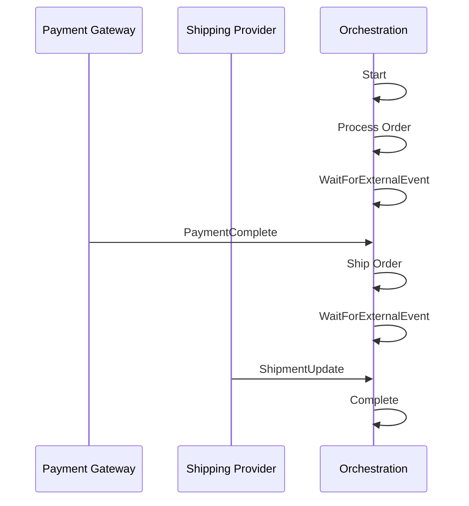
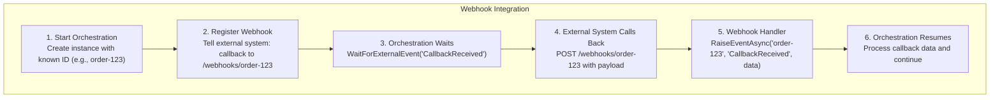

# External Events Pattern
{: .no_toc }

## Table of contents
{: .no_toc .text-delta }

1. TOC
{:toc}

---

React to external signals and events that arrive asynchronously during orchestration execution.

---

## Overview

The external events pattern allows orchestrations to pause and wait for signals from external systems, users, or other orchestrations. This enables event-driven workflow patterns.



---

## Use Cases

- **Payment Processing**: Wait for payment gateway callbacks
- **Shipping Updates**: React to carrier tracking events
- **Third-Party Integrations**: Wait for external API webhooks
- **IoT Scenarios**: React to device state changes
- **Cross-System Coordination**: Synchronize between systems

---

## Implementation

### C# (.NET)

```csharp
using Microsoft.DurableTask;

[DurableTask(nameof(OrderFulfillmentOrchestrator))]
public class OrderFulfillmentOrchestrator : TaskOrchestrator<Order, OrderResult>
{
    public override async Task<OrderResult> RunAsync(
        TaskOrchestrationContext context, 
        Order order)
    {
        // Step 1: Submit order to payment provider
        await context.CallActivityAsync(
            nameof(SubmitPaymentActivity),
            order.Payment
        );
        
        // Step 2: Wait for payment confirmation
        var paymentEvent = await context.WaitForExternalEvent<PaymentConfirmation>(
            "PaymentConfirmed"
        );
        
        if (!paymentEvent.Success)
        {
            return new OrderResult { Status = "PaymentFailed" };
        }
        
        // Step 3: Submit to shipping
        await context.CallActivityAsync(
            nameof(SubmitShipmentActivity),
            order
        );
        
        // Step 4: Wait for shipment events (can receive multiple)
        var shipped = false;
        var trackingUpdates = new List<ShipmentUpdate>();
        
        while (!shipped)
        {
            var update = await context.WaitForExternalEvent<ShipmentUpdate>(
                "ShipmentUpdate"
            );
            
            trackingUpdates.Add(update);
            
            if (update.Status == "Delivered")
            {
                shipped = true;
            }
        }
        
        return new OrderResult
        {
            Status = "Completed",
            TransactionId = paymentEvent.TransactionId,
            TrackingHistory = trackingUpdates
        };
    }
}
```

### Raising Events from External Systems

```csharp
// Webhook controller that receives payment callbacks
[ApiController]
[Route("api/webhooks")]
public class WebhookController : ControllerBase
{
    private readonly DurableTaskClient _client;
    
    [HttpPost("payment")]
    public async Task<IActionResult> PaymentWebhook([FromBody] PaymentWebhookPayload payload)
    {
        // Map webhook to orchestration instance
        var instanceId = payload.OrderId; // Assuming order ID is the instance ID
        
        await _client.RaiseEventAsync(
            instanceId,
            "PaymentConfirmed",
            new PaymentConfirmation
            {
                Success = payload.Status == "completed",
                TransactionId = payload.TransactionId,
                Amount = payload.Amount
            }
        );
        
        return Ok();
    }
    
    [HttpPost("shipping")]
    public async Task<IActionResult> ShippingWebhook([FromBody] ShippingWebhookPayload payload)
    {
        await _client.RaiseEventAsync(
            payload.OrderId,
            "ShipmentUpdate",
            new ShipmentUpdate
            {
                Status = payload.Status,
                Location = payload.Location,
                Timestamp = payload.Timestamp
            }
        );
        
        return Ok();
    }
}
```

### Python

```python
from durabletask import task

@task.orchestrator
def order_fulfillment_orchestrator(ctx: task.OrchestrationContext, order: dict):
    """Process order with external event coordination."""
    
    # Submit payment
    yield ctx.call_activity("submit_payment", input=order["payment"])
    
    # Wait for payment confirmation
    payment_event = yield ctx.wait_for_external_event("PaymentConfirmed")
    
    if not payment_event["success"]:
        return {"status": "PaymentFailed"}
    
    # Submit to shipping
    yield ctx.call_activity("submit_shipment", input=order)
    
    # Wait for delivery
    tracking_updates = []
    shipped = False
    
    while not shipped:
        update = yield ctx.wait_for_external_event("ShipmentUpdate")
        tracking_updates.append(update)
        
        if update["status"] == "Delivered":
            shipped = True
    
    return {
        "status": "Completed",
        "transaction_id": payment_event["transaction_id"],
        "tracking_history": tracking_updates
    }
```

### Java

```java
public class OrderFulfillmentOrchestrator implements TaskOrchestrator {
    @Override
    public OrderResult run(TaskOrchestrationContext ctx) {
        Order order = ctx.getInput(Order.class);
        
        // Submit payment
        ctx.callActivity("SubmitPayment", order.getPayment(), Void.class).await();
        
        // Wait for payment confirmation
        PaymentConfirmation payment = ctx.waitForExternalEvent(
            "PaymentConfirmed", 
            PaymentConfirmation.class
        ).await();
        
        if (!payment.isSuccess()) {
            return new OrderResult("PaymentFailed");
        }
        
        // Submit shipment
        ctx.callActivity("SubmitShipment", order, Void.class).await();
        
        // Wait for delivery
        List<ShipmentUpdate> updates = new ArrayList<>();
        boolean shipped = false;
        
        while (!shipped) {
            ShipmentUpdate update = ctx.waitForExternalEvent(
                "ShipmentUpdate", 
                ShipmentUpdate.class
            ).await();
            
            updates.add(update);
            
            if ("Delivered".equals(update.getStatus())) {
                shipped = true;
            }
        }
        
        return new OrderResult("Completed", payment.getTransactionId(), updates);
    }
}
```

---

## Advanced Patterns

### Multiple Event Types

```csharp
public override async Task<WorkflowResult> RunAsync(
    TaskOrchestrationContext context, 
    WorkflowInput input)
{
    // Wait for any of multiple event types
    var approvalTask = context.WaitForExternalEvent<ApprovalEvent>("Approved");
    var rejectionTask = context.WaitForExternalEvent<RejectionEvent>("Rejected");
    var cancellationTask = context.WaitForExternalEvent<CancellationEvent>("Cancelled");
    
    var winner = await Task.WhenAny(approvalTask, rejectionTask, cancellationTask);
    
    if (winner == approvalTask)
    {
        var approval = await approvalTask;
        return new WorkflowResult { Status = "Approved", Data = approval };
    }
    else if (winner == rejectionTask)
    {
        var rejection = await rejectionTask;
        return new WorkflowResult { Status = "Rejected", Reason = rejection.Reason };
    }
    else
    {
        var cancellation = await cancellationTask;
        return new WorkflowResult { Status = "Cancelled" };
    }
}
```

### Event with Timeout

```csharp
public override async Task<ProcessResult> RunAsync(
    TaskOrchestrationContext context, 
    ProcessInput input)
{
    using var cts = new CancellationTokenSource();
    
    var eventTask = context.WaitForExternalEvent<ExternalData>("DataReceived");
    var timeoutTask = context.CreateTimer(
        context.CurrentUtcDateTime.AddMinutes(30), 
        cts.Token
    );
    
    var winner = await Task.WhenAny(eventTask, timeoutTask);
    
    if (winner == eventTask)
    {
        cts.Cancel();
        var data = await eventTask;
        
        // Process the received data
        return await ProcessDataAsync(context, data);
    }
    else
    {
        // Timeout - use default or cached data
        var defaultData = await context.CallActivityAsync<ExternalData>(
            nameof(GetDefaultData),
            input
        );
        
        return await ProcessDataAsync(context, defaultData);
    }
}
```

### Buffered Events

```csharp
public override async Task<BatchResult> RunAsync(
    TaskOrchestrationContext context, 
    BatchConfig config)
{
    var collectedEvents = new List<DataEvent>();
    var batchDeadline = context.CurrentUtcDateTime.AddMinutes(5);
    
    while (context.CurrentUtcDateTime < batchDeadline && 
           collectedEvents.Count < config.MaxBatchSize)
    {
        using var cts = new CancellationTokenSource();
        
        var eventTask = context.WaitForExternalEvent<DataEvent>("DataEvent");
        var timerTask = context.CreateTimer(batchDeadline, cts.Token);
        
        var winner = await Task.WhenAny(eventTask, timerTask);
        
        if (winner == eventTask)
        {
            cts.Cancel();
            collectedEvents.Add(await eventTask);
        }
        else
        {
            break; // Deadline reached
        }
    }
    
    // Process collected batch
    return await context.CallActivityAsync<BatchResult>(
        nameof(ProcessBatch),
        collectedEvents
    );
}
```

---

## Event Correlation

### Using Instance ID for Correlation

```csharp
// When starting the orchestration, use a known ID
var orderId = Guid.NewGuid().ToString();

var instanceId = await client.ScheduleNewOrchestrationInstanceAsync(
    nameof(OrderFulfillmentOrchestrator),
    order,
    new StartOrchestrationOptions { InstanceId = orderId }
);

// External systems use the same ID to send events
await client.RaiseEventAsync(orderId, "PaymentConfirmed", paymentData);
```

### Using Custom Status for Tracking

```csharp
public override async Task<OrderResult> RunAsync(
    TaskOrchestrationContext context, 
    Order order)
{
    context.SetCustomStatus(new OrderStatus
    {
        Stage = "AwaitingPayment",
        OrderId = order.Id
    });
    
    var payment = await context.WaitForExternalEvent<PaymentConfirmation>("PaymentConfirmed");
    
    context.SetCustomStatus(new OrderStatus
    {
        Stage = "AwaitingShipment",
        OrderId = order.Id,
        TransactionId = payment.TransactionId
    });
    
    // Continue processing...
}
```

---

## Webhook Integration Pattern



---

## Best Practices

1. **Use meaningful event names** - Make event purpose clear
2. **Include correlation data** - Ensure events can be matched to instances
3. **Handle duplicates** - Events may be delivered more than once
4. **Set timeouts** - Don't wait indefinitely for external events
5. **Log event details** - For debugging and auditing
6. **Validate event data** - Don't trust external input blindly

---

## Related Patterns

- [Human Interaction](human-interaction.md) - Special case of external events
- [Aggregator](aggregator.md) - For continuous event aggregation
- [Async HTTP APIs](async-http.md) - For polling-based patterns
